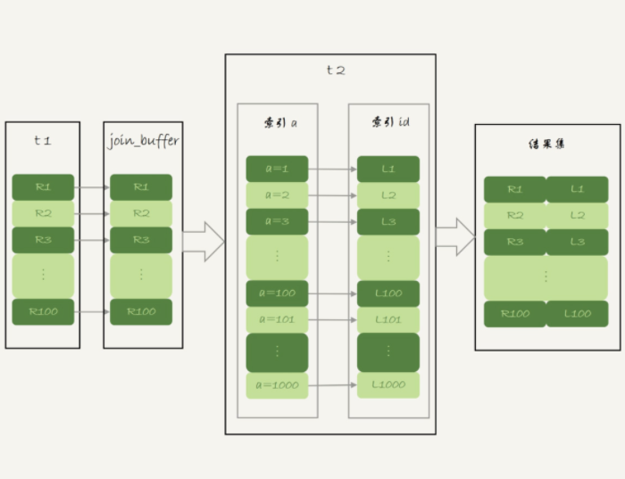

# Mysql实战学习
## 普通索引和唯一索引，应该怎么选择？


从性能的角度考虑，你选择唯一索引还是普通索引呢？从这两种索引对**查询语句**和**更新语句**的性能影响来进行分析
### 查询过程
假设，执行查询的语句是 select id from T where k=5
- 对于普通索引来说，查找到满足条件的第一个记录后，需要查找下一个记录，直到碰到第一个不满足条件的记录
- 对于唯一索引来说，由于索引定义了唯一性，查找到第一个满足条件的记录后，就会停止继续检索。 
  
这个不同带来的性能差距微乎其微，原因是：
- InnoDB 的数据是按数据页为单位来读写的。也就是说，当需要读一条记录的时候，并不是将这个记录本身从磁盘读出来，而是以页为单位，将其整体读入内存。在InnoDB 中，每个数据页的大小默认是 16KB
- 引擎是按页读写的，所以说，当找到 k=5 的记录的时候，它所在的数据页就都在内存里了。那么，对于普通索引来说，要多做的那一次“查找和判断下一条记录”的操作，就只需要一次指针寻找和一次计算

### 更新过程
1. 当需要更新一个数据页时，如果数据页在内存中就直接更新，而如果这个数据页还没有在内存中的话，在不影响数据一致性的前提下，InooDB会将这些更新操作缓存在change buffer中，这样就不需要从磁盘中读入这个数据页了
2. 在下次查询需要访问这个数据页的时候，将数据页读入内存，然后执行 change buffer 中与这个页有关的操作。通过这种方式就能保证这个数据逻辑的正确性
3. 将 change buffer 中的操作应用到原数据页，得到最新结果的过程称为 merge。除了访问这个数据页会触发 merge 外，系统有后台线程会定期 merge。在数据库正常关闭（shutdown）的过程中，也会执行 merge 操作
4. 显然，如果能够将更新操作先记录在 change buffer，减少读磁盘，语句的执行速度会得到明显的提升。而且，数据读入内存是需要占用 buffer pool 的，所以这种方式还能够避免占用内存，提高内存利用率。

什么条件下可以使用 change buffer？
- 对于唯一索引来说，所有的更新操作都要先判断这个操作是否违反唯一性约束，而这必须要将数据页读入内存才能判断。如果都已经读入到内存了，那直接更新内存会更快，就没必要使用 change buffer 了
- 唯一索引的更新就不能使用change buffer，只有普通索引可以使用
- change buffer用的是buffer pool里的内存。change buffer的大小，可以通过参数innodb_change_buffer_max_size来动态设置。这个参数设置为50的时候，表示change buffer的大小最多只能占用buffer pool的50%
- 将数据从磁盘读入内存涉及随机IO的访问，是数据库里面成本最高的操作之一。change buffer因为减少了随机磁盘访问，所以对更新性能的提升是会很明显的

### change buffer的使用场景
- 使用change buffer对更新过程有加速作用
- change buffer只限于用在普通索引的场景下，而不适用于唯一索引
- 对于写多读少的业务来说，页面在写完以后马上被访问到的概率比较小，此时change buffer的使用效果最好
- 如果是写入之后马上会做查询，由于访问数据页会立即触发merge过程。这样随机访问IO的次数不会减少，反而增加了change buffer的维护代价

### 索引选择和实践
1. 在业务能保证唯一性的前提下，尽量使用普通索引
2. 普通索引和 change buffer 的配合使用，对于数据量大的表的更新优化是很明显的

### change buffer和redo log
**更新操作**
```shell
insert into t(id,k) values(id1,k1),(id2,k2)
```
这里，我们假设当前 k 索引树的状态，查找到位置后，k1所在的数据页在内存(InnoDB buffer pool) 中，k2所在的数据页不在内存中


这条更新语句做了如下的操作:
1. Page 1 在内存中，直接更新内存；
2. Page 2 没有在内存中，就在内存的change buffer区域，记录下“我要往 Page 2 插入一行”这个信息
3. 将上述两个动作记入redo log中（图中3和4）。

执行这条更新语句的成本很低，就是写了两处内存，然后写了一处磁盘（两次操作合在一起写了一次磁盘），而且还是顺序写的

**查询操作**
```shell
select * from t where k in (k1, k2)
```
如果读语句发生在更新语句后不久，内存中的数据都还在，那么此时的这两个读操作就与系统表空间（ibdata1）和 redo log（ib_log_fileX）无关了


从图中可以看到：
1. 读 Page 1 的时候，直接从内存返回
2. 要读 Page 2 的时候，需要把 Page 2 从磁盘读入内存中，然后应用change buffer里面的操作日志，生成一个正确的版本并返回结果

**总结**：redo log主要节省的是随机写磁盘的IO消耗（转成顺序写），而change buffer主要节省的则是随机读磁盘的IO消耗

### change buffer会丢失吗
如果某次写入使用了change buffer机制，之后主机异常重启，是否会丢失change buffer和数据？

这个问题的答案是不会丢失。虽然是只更新内存，但是在事务提交的时候，我们把change buffer的操作也记录到redo log里了，所以崩溃恢复的时候，change buffer也能找回来

### merge 的执行流程
1. 从磁盘读入数据页到内存（老版本的数据页）；
2. 从change buffer里找出这个数据页的 change buffer 记录 (可能有多个），依次应用，得到新版数据页；
3. 写redo log。这个redo log包含了数据的变更和change buffer的变更。到这里merge过程就结束了。这时候，数据页和内存中change buffer对应的磁盘位置都还没有修改，属于脏页，之后各自刷回自己的物理数据，就是另外一个过程了。

## MySQL为什么有时候会选错索引？
### 优化器的逻辑
优化器选择索引的目的，是找到一个最优的执行方案，并用最小的代价去执行语句
- 在数据库里面，扫描行数是影响执行代价的因素之一。扫描的行数越少，意味着访问磁盘数据的次数越少，消耗的 CPU 资源越少。
- 扫描行数并不是唯一的判断标准，优化器还会结合是否使用临时表、是否排序等因素进行综合判断

**扫描行数是怎么判断的？**
- 根据统计信息来估算记录数
- 统计信息就是索引的“区分度”。显然，一个索引上不同的值越多，这个索引的区分度就越好。而一个索引上不同的值的个数，我们称之为“基数”（cardinality）
- show index (from table)方法，看到一个索引的基数

**MySQL 是怎样得到索引的基数的呢？**
- 把整张表取出来一行行统计，虽然可以得到精确的结果，但是代价太高了，所以只能选择“采样统计”
- 样统计的时候，InnoDB 默认会选择 N 个数据页，统计这些页面上的不同值，得到一个平均值，然后乘以这个索引的页面数，就得到了这个索引的基数

优化器选择使用哪个索引，除了索引统计的基数外，还需要判断执行这个语句本身要扫描多少行。

可以通过explain查看优化扫描的行数rows。

不是说哪个rows少就会选择哪一个，优化器还会考虑二级索引的回表代价。

analyze table t 命令，可以用来重新统计索引信息。

### 索引选择异常和处理
- 第一种方法是，像我们第一个例子一样，采用 force index 强行选择一个索引
- 第二种方法是，我们可以考虑修改语句，引导 MySQL 使用我们期望的索引
- 第三种方法是，在有些场景下，我们可以新建一个更合适的索引，来提供给优化器做选择，或删掉误用的索引。

## 怎么给字符串字段加索引？
1. 直接创建完整索引，这样可能比较占用空间；
2. 创建前缀索引，节省空间，但会增加查询扫描次数，并且不能使用覆盖索引；
3. 倒序存储，再创建前缀索引，用于绕过字符串本身前缀的区分度不够的问题；
4. 创建 hash 字段索引，查询性能稳定，有额外的存储和计算消耗，跟第三种方式一样，都不支持范围扫描。

## 为什么我的MySQL会“抖”一下？

### 什么是脏页，什么是干净页？
当内存数据页跟磁盘数据页内容不一致的时候，我们称这个内存页为“脏页”。内存数据写入到磁盘后，内存和磁盘上的数据页的内容就一致了，称为“干净页”。

### 什么情况会引发数据库的刷脏页（flush）过程？
1. InnoDB 的 redo log 写满了。这时候系统会停止所有更新操作，把 checkpoint 往前推进，redo log 留出空间可以继续写


把 checkpoint 位置从 CP 推进到 CP’，就需要将两个点之间的日志（浅绿色部分），对应的所有脏页都 flush 到磁盘上。之后，图中从 write pos 到 CP’之间就是可以再写入的 redo log 的区域
2. 系统内存不足。当需要新的内存页，而内存不够用的时候，就要淘汰一些数据页，空出内存给别的数据页使用。如果淘汰的是“脏页”，就要先将脏页写到磁盘
3. MySQL 认为系统“空闲”的时候。
4. MySQL 正常关闭的情况。

### InnoDB刷脏页的控制策略
- flush能力和InnoDB所在主机的IO能力成正比
- innodb_io_capacity参数，告诉 InnoDB 你的磁盘能力，建议你设置成磁盘的 IOPS
磁盘的 IOPS 获取方式：
```shell script
 fio -filename=$filename -direct=1 -iodepth 1 -thread -rw=randrw -ioengine=psync -bs=16k -size=500M -numjobs=10 -runtime=10 -group_reporting -name=mytest 
```
- 合理地设置 innodb_io_capacity 的值，并且平时要多关注脏页比例，不要让它经常接近 75%
脏页比例是通过 Innodb_buffer_pool_pages_dirty/Innodb_buffer_pool_pages_total 得到的，具体的命令参考下面的代码：
```shell script
select VARIABLE_VALUE into @a from global_status where VARIABLE_NAME = 'Innodb_buffer_pool_pages_dirty';
select VARIABLE_VALUE into @b from global_status where VARIABLE_NAME = 'Innodb_buffer_pool_pages_total';
select @a/@b;
```
- 刷一个脏页的时候，如果这个数据页旁边的数据页刚好是脏页，就会把这个“邻居”也带着一起刷掉。在 InnoDB 中，innodb_flush_neighbors 参数就是用来控制这个行为的，值为 1 的时候会有上述的“连坐”机制，值为 0 时表示不找邻居，自己刷自己的

## 为什么表数据删掉一半，表文件大小不变？

### 参数innodb_file_per_table
innodb_file_per_table 控制的：
1. 这个参数设置为 OFF 表示的是，表的数据放在系统共享表空间，也就是跟数据字典放在一起；
2. 这个参数设置为 ON 表示的是，每个 InnoDB 表数据存储在一个以 .ibd 为后缀的文件中。
3. 从 MySQL 5.6.6 版本开始，它的默认值就是 ON 了。

### 数据删除流程
1. 删除数据行或者整个表的数据，并不会让表空间变小，而是将数据行或者数据页标记为可复用
2. 插入数据导致页分裂，也会造成空洞
3. 把这些空洞去掉，就能达到收缩表空间的目的，重建表就能做到

### 重建表
Online DDL重建表的流程：
1. 建立一个临时文件，扫描表 A 主键的所有数据页；
2. 用数据页中表 A 的记录生成 B+ 树，存储到临时文件中；
3. 生成临时文件的过程中，将所有对 A 的操作记录在一个日志文件（row log）中，对应的是图中 state2 的状态；
4. 临时文件生成后，将日志文件中的操作应用到临时文件，得到一个逻辑数据上与表 A 相同的数据文件，对应的就是图中 state3 的状态；
5. 用临时文件替换表 A 的数据文件。


### alter table,analyze table,optimize table的区别
- 从 MySQL 5.6 版本开始，alter table t engine = InnoDB（也就是 recreate）默认的就是上面图 online_ddl 的流程了；
- analyze table t 其实不是重建表，只是对表的索引信息做重新统计，没有修改数据，这个过程中加了 MDL 读锁；
- optimize table t 等于 recreate+analyze。

## count(*)为什么慢？

### count(*) 的实现方式
- MyISAM 引擎把一个表的总行数存在了磁盘上，因此执行 count(*) 的时候会直接返回这个数，效率很高；
- InnoDB 引擎就麻烦了，它执行 count(*) 的时候，需要把数据一行一行地从引擎里面读出来，然后累积计数。
- 如果加了 where 条件的话，MyISAM 表也是不能返回得这么快的

### 为什么 InnoDB 不跟 MyISAM 一样，也把数字存起来呢？
这和 InnoDB 的事务设计有关系，可重复读是它默认的隔离级别，在代码上就是通过多版本并发控制，也就是 MVCC 来实现的。每一行记录都要判断自己是否对这个会话可见，因此对于 count(*) 请求来说，InnoDB 只好把数据一行一行地读出依次判断，可见的行才能够用于计算“基于这个查询”的表的总行数。

- MyISAM 表虽然 count(*) 很快，但是不支持事务；
- show table status 命令虽然返回很快，但是不准确；
- InnoDB 表直接 count(*) 会遍历全表，虽然结果准确，但会导致性能问题。

### 用缓存系统保存计数
- 缓存系统可能会丢失更新
- 缓存系统中的值可能在逻辑上是不精确的
- 需要分布式事务来保障逻辑上的精确性

### 在数据库保存计数
插入或者删除数据可以和计数逻辑放在一个事务中

### 不同的count用法和区别
- count(主键 id)，InnoDB 引擎会遍历整张表，把每一行的 id 值都取出来，返回给 server 层。server 层拿到 id 后，判断是不可能为空的，就按行累加
- count(1)，InnoDB 引擎遍历整张表，但不取值。server 层对于返回的每一行，放一个数字“1”进去，判断是不可能为空的，按行累加。
- count(字段)，还需要额外判断是否为null
- count(*)，并不会把全部字段取出来，而是专门做了优化，不取值
- 按效率排序：count(字段)<count(主键 id)<count(1)≈count(*)

## “order by”是怎么工作的？
表的部分定义：
```shell script
CREATE TABLE `t` (
  `id` int(11) NOT NULL,
  `city` varchar(16) NOT NULL,
  `name` varchar(16) NOT NULL,
  `age` int(11) NOT NULL,
  `addr` varchar(128) DEFAULT NULL,
  PRIMARY KEY (`id`),
  KEY `city` (`city`)
) ENGINE=InnoDB;
```
SQL 语句:
 ```shell script
select city,name,age from t where city='杭州' order by name limit 1000  ;
```

### 全字段排序

explain 命令来看看这个语句的执行情况:


extra 这个字段中的“Using filesort”表示的就是需要排序，MySQL 会给每个线程分配一块内存用于排序，称为 sort_buffer

语句执行流程如下所示:
1. 初始化 sort_buffer，确定放入 name、city、age 这三个字段；
2. 从索引 city 找到第一个满足 city='杭州’条件的主键 id，也就是图中的 ID_X；
3. 到主键 id 索引取出整行，取 name、city、age 三个字段的值，存入 sort_buffer 中；
4. 从索引 city 取下一个记录的主键 id；
5. 重复步骤 3、4 直到 city 的值不满足查询条件为止，对应的主键 id 也就是图中的 ID_Y；
6. 对 sort_buffer 中的数据按照字段 name 做快速排序；
7. 按照排序结果取前 1000 行返回给客户端。


sort_buffer_size，就是 MySQL 为排序开辟的内存（sort_buffer）的大小。如果要排序的数据量小于 sort_buffer_size，排序就在内存中完成。但如果排序数据量太大，内存放不下，则不得不利用磁盘临时文件辅助排序

**如何确定一个排序语句是否使用了临时文件？**
```sql
/* 打开 optimizer_trace，只对本线程有效 */
SET optimizer_trace='enabled=on'; 

/* @a 保存 Innodb_rows_read 的初始值 */
select VARIABLE_VALUE into @a from  performance_schema.session_status where variable_name = 'Innodb_rows_read';
 
/* 执行语句 */
select city, name,age from t where city='杭州' order by name limit 1000; 
 
/* 查看 OPTIMIZER_TRACE 输出 */
SELECT * FROM `information_schema`.`OPTIMIZER_TRACE`\G
 
/* @b 保存 Innodb_rows_read 的当前值 */
select VARIABLE_VALUE into @b from performance_schema.session_status where variable_name = 'Innodb_rows_read';
 
/* 计算 Innodb_rows_read 差值 */
select @b-@a;
```
可以从 number_of_tmp_files 中看到是否使用了临时文件，一般使用归并排序算法

### rowid 排序
MySQL 认为排序的单行长度太大会怎么做呢?
```shell script
SET max_length_for_sort_data = 16;
```
max_length_for_sort_data，是 MySQL 中专门控制用于排序的行数据的长度的一个参数。它的意思是，如果单行的长度超过这个值，MySQL 就认为单行太大，要换一个算法

新的算法放入 sort_buffer 的字段，只有要排序的列（即 name 字段）和主键 id

流程就变成如下所示:
1. 初始化 sort_buffer，确定放入两个字段，即 name 和 id；
2. 从索引 city 找到第一个满足 city='杭州’条件的主键 id，也就是图中的 ID_X；
3. 到主键 id 索引取出整行，取 name、id 这两个字段，存入 sort_buffer 中；
4. 从索引 city 取下一个记录的主键 id；
5. 重复步骤 3、4 直到不满足 city='杭州’条件为止，也就是图中的 ID_Y；
6. 对 sort_buffer 中的数据按照字段 name 进行排序；
7. 遍历排序结果，取前 1000 行，并按照 id 的值回到原表中取出 city、name 和 age 三个字段返回给客户端。


### 全字段排序 VS rowid 排序
- 如果 MySQL 实在是担心排序内存太小，会影响排序效率，才会采用 rowid 排序算法，这样排序过程中一次可以排序更多行，但是需要再回到原表去取数据
- 如果 MySQL 认为内存足够大，会优先选择全字段排序，把需要的字段都放到 sort_buffer 中，这样排序后就会直接从内存里面返回查询结果了，不用再回到原表去取数据

### 如何优化sql减少排序的操作
1. 创建联合索引，使数据天然有序
```sql
alter table t add index city_user(city, name);
```
2. 使用覆盖索引，进一步避免回表
```sql
alter table t add index city_user_age(city, name, age);
```

### 案例
这个英语学习 App 首页有一个随机显示单词的功能，也就是根据每个用户的级别有一个单词表，然后这个用户每次访问首页的时候，都会随机滚动显示三个单词。他们发现随着单词表变大，选单词这个逻辑变得越来越慢，甚至影响到了首页的打开速度。

现在，如果让你来设计这个 SQL 语句，你会怎么写呢？

为了便于理解，我对这个例子进行了简化：去掉每个级别的用户都有一个对应的单词表这个逻辑，直接就是从一个单词表中随机选出三个单词。这个表的建表语句和初始数据的命令如下：
```sql
mysql> CREATE TABLE `words` (
  `id` int(11) NOT NULL AUTO_INCREMENT,
  `word` varchar(64) DEFAULT NULL,
  PRIMARY KEY (`id`)
) ENGINE=InnoDB;
 
delimiter ;;
create procedure idata()
begin
  declare i int;
  set i=0;
  while i<10000 do
    insert into words(word) values(concat(char(97+(i div 1000)), char(97+(i % 1000 div 100)), char(97+(i % 100 div 10)), char(97+(i % 10))));
    set i=i+1;
  end while;
end;;
delimiter ;
 
call idata();
```

**内存临时表**
```sql
mysql> select word from words order by rand() limit 3;
```
虽然这个 SQL 语句写法很简单，但执行流程却有点复杂的。通过explain命令来看看这个语句的执行情况，Extra 字段显示 Using temporary，表示的是需要使用临时表；Using filesort，表示的是需要执行排序操作。

这条语句的执行流程是这样的：
1. 创建一个临时表。这个临时表使用的是 memory 引擎，表里有两个字段，第一个字段是 double 类型，为了后面描述方便，记为字段 R，第二个字段是 varchar(64) 类型，记为字段 W。并且，这个表没有建索引。
2. 从 words 表中，按主键顺序取出所有的 word 值。对于每一个 word 值，调用 rand() 函数生成一个大于 0 小于 1 的随机小数，并把这个随机小数和 word 分别存入临时表的 R 和 W 字段中，到此，扫描行数是 10000。
3. 现在临时表有 10000 行数据了，接下来你要在这个没有索引的内存临时表上，按照字段 R 排序。
4. 初始化 sort_buffer。sort_buffer 中有两个字段，一个是 double 类型，另一个是整型。
5. 从内存临时表中一行一行地取出 R 值和位置信息（我后面会和你解释这里为什么是“位置信息”），分别存入 sort_buffer 中的两个字段里。这个过程要对内存临时表做全表扫描，此时扫描行数增加 10000，变成了 20000。
6. 在 sort_buffer 中根据 R 的值进行排序。注意，这个过程没有涉及到表操作，所以不会增加扫描行数。
7. 排序完成后，取出前三个结果的位置信息，依次到内存临时表中取出 word 值，返回给客户端。这个过程中，访问了表的三行数据，总扫描行数变成了 20003。


通过上面的分析：通过order by rand()过程是比较复杂的，性能不高，那如何优化呢？

**随机排序方法1：**
1. 取得这个表的主键 id 的最大值 M 和最小值 N;
2. 用随机函数生成一个最大值到最小值之间的数 X = (M-N)*rand() + N;
3. 取不小于 X 的第一个 ID 的行。
```sql
mysql> select max(id),min(id) into @M,@N from t ;
set @X= floor((@M-@N+1)*rand() + @N);
select * from t where id >= @X limit 1;
```
这个方法效率很高，因为取 max(id) 和 min(id) 都是不需要扫描索引的，而第三步的 select 也可以用索引快速定位，可以认为就只扫描了 3 行。但实际上，这个算法本身并不严格满足题目的随机要求，因为 ID 中间可能有空洞，因此选择不同行的概率不一样，不是真正的随机

**随机排序方法2：**
1. 取得整个表的行数，并记为 C。
2. 取得 Y = floor(C * rand())。 floor 函数在这里的作用，就是取整数部分。
3. 再用 limit Y,1 取得一行。
```sql
mysql> select count(*) into @C from t;
set @Y1 = floor(@C * rand());
set @Y2 = floor(@C * rand());
set @Y3 = floor(@C * rand());
select * from t limit @Y1,1; // 在应用代码里面取 Y1、Y2、Y3 值，拼出 SQL 后执行
select * from t limit @Y2,1;
select * from t limit @Y3,1;
```

**优化后的方法3：**
1. 随机出Y1、Y2、Y3后，算出Ymax、Ymin
2. 再用 select id from t limit Ymin，(Ymax - Ymin)
3. 得到id集后算出Y1、Y2、Y3对应的三个id
4. 最后 select * from t where id in (id1, id2, id3)

## 为什么这些SQL语句逻辑相同，性能却差异巨大？

### 案例一：条件字段函数操作
建表语句：
```sql
mysql> CREATE TABLE `tradelog` (
  `id` int(11) NOT NULL,
  `tradeid` varchar(32) DEFAULT NULL,
  `operator` int(11) DEFAULT NULL,
  `t_modified` datetime DEFAULT NULL,
  PRIMARY KEY (`id`),
  KEY `tradeid` (`tradeid`),
  KEY `t_modified` (`t_modified`)
) ENGINE=InnoDB DEFAULT CHARSET=utf8mb4;
```
需求：假设，现在已经记录了从 2016 年初到 2018 年底的所有数据，运营部门有一个需求是，要统计发生在所有年份中 7 月份的交易记录总数
```sql
mysql> select count(*) from tradelog where month(t_modified)=7;
```
上述sql语句无法用到t_modified的索引，因为**对索引字段做函数操作，可能会破坏索引值的有序性，因此优化器就决定放弃走树搜索功能**

需要改写为：
```sql
mysql> select count(*) from tradelog where
    -> (t_modified >= '2016-7-1' and t_modified<'2016-8-1') or
    -> (t_modified >= '2017-7-1' and t_modified<'2017-8-1') or 
    -> (t_modified >= '2018-7-1' and t_modified<'2018-8-1');
```

### 案例二：隐式类型转换
```sql
mysql> select * from tradelog where tradeid=110717;
```
tradeid 这个字段上有索引，但是tradeid 的字段类型是 varchar(32)，而输入的参数却是整型，所以需要做类型转换

对于优化器来说，这个语句相当于：
```sql
mysql> select * from tradelog where  CAST(tradid AS signed int) = 110717;
```

### 案例三：隐式字符编码转换
```sql
mysql> CREATE TABLE `trade_detail` (
  `id` int(11) NOT NULL,
  `tradeid` varchar(32) DEFAULT NULL,
  `trade_step` int(11) DEFAULT NULL, /* 操作步骤 */
  `step_info` varchar(32) DEFAULT NULL, /* 步骤信息 */
  PRIMARY KEY (`id`),
  KEY `tradeid` (`tradeid`)
) ENGINE=InnoDB DEFAULT CHARSET=utf8;
 
insert into tradelog values(1, 'aaaaaaaa', 1000, now());
insert into tradelog values(2, 'aaaaaaab', 1000, now());
insert into tradelog values(3, 'aaaaaaac', 1000, now());
 
insert into trade_detail values(1, 'aaaaaaaa', 1, 'add');
insert into trade_detail values(2, 'aaaaaaaa', 2, 'update');
insert into trade_detail values(3, 'aaaaaaaa', 3, 'commit');
insert into trade_detail values(4, 'aaaaaaab', 1, 'add');
insert into trade_detail values(5, 'aaaaaaab', 2, 'update');
insert into trade_detail values(6, 'aaaaaaab', 3, 'update again');
insert into trade_detail values(7, 'aaaaaaab', 4, 'commit');
insert into trade_detail values(8, 'aaaaaaac', 1, 'add');
insert into trade_detail values(9, 'aaaaaaac', 2, 'update');
insert into trade_detail values(10, 'aaaaaaac', 3, 'update again');
insert into trade_detail values(11, 'aaaaaaac', 4, 'commit');
```
如果要查询 id=2 的交易的所有操作步骤信息，SQL 语句可以这么写：
```sql
mysql> select d.* from tradelog l, trade_detail d where d.tradeid=l.tradeid and l.id=2; 
```
因为这两个表的字符集不同，一个是 utf8，一个是 utf8mb4，所以做表连接查询的时候用不上关联字段的索引，也就是说，实际上这个语句等同于下面这个写法
```sql
select * from trade_detail  where CONVERT(traideid USING utf8mb4)=$L2.tradeid.value; 
```
优化方案1：把 trade_detail 表上的 tradeid 字段的字符集也改成 utf8mb4
```sql
alter table trade_detail modify tradeid varchar(32) CHARACTER SET utf8mb4 default null;
```
优化方案2：修改 SQL 语句的方法
```sql
mysql> select d.* from tradelog l , trade_detail d where d.tradeid=CONVERT(l.tradeid USING utf8) and l.id=2;
```

### 总结
对索引字段做函数操作，可能会破坏索引值的有序性，因此优化器就决定放弃走树搜索功能

## 幻读是什么，幻读有什么问题？
```sql
CREATE TABLE `t` (
  `id` int(11) NOT NULL,
  `c` int(11) DEFAULT NULL,
  `d` int(11) DEFAULT NULL,
  PRIMARY KEY (`id`),
  KEY `c` (`c`)
) ENGINE=InnoDB;
 
insert into t values(0,0,0),(5,5,5),
(10,10,10),(15,15,15),(20,20,20),(25,25,25);
```

### 幻读是什么？

1. Q1 只返回 id=5 这一行；
2. 在 T2 时刻，session B 把 id=0 这一行的 d 值改成了 5，因此 T3 时刻 Q2 查出来的是 id=0 和 id=5 这两行；
3. 在 T4 时刻，session C 又插入一行（1,1,5），因此 T5 时刻 Q3 查出来的是 id=0、id=1 和 id=5 的这三行。
其中，Q3 读到 id=1 这一行的现象，被称为“幻读”。也就是说，幻读指的是一个事务在前后两次查询同一个范围的时候，后一次查询看到了前一次查询没有看到的行。
幻读仅专指“新插入的行”。

### 幻读有什么问题？
1. 首先是语义上的。session A 在 T1 时刻就声明了，“我要把所有 d=5 的行锁住，不准别的事务进行读写操作”。而实际上，这个语义被破坏了
2. 其次，是数据一致性的问题。这个一致性，不止是数据库内部数据状态在此刻的一致性，还包含了数据和日志在逻辑上的一致性
3. 也就是说，即使把所有的记录都加上锁，还是阻止不了新插入的记录，这也是为什么“幻读”会被单独拿出来解决的原因

### 如何解决幻读？
产生幻读的原因是，行锁只能锁住行，但是新插入记录这个动作，要更新的是记录之间的“间隙”。因此，为了解决幻读问题，InnoDB 只好引入新的锁，也就是间隙锁 (Gap Lock)。

隙锁，锁的就是两个值之间的空隙。比如文章开头的表 t，初始化插入了 6 个记录，这就产生了 7 个间隙


当你执行 select * from t where d=5 for update 的时候，就不止是给数据库中已有的 6 个记录加上了行锁，还同时加了 7 个间隙锁。这样就确保了无法再插入新的记录。

间隙锁和行锁合称 next-key lock，每个 next-key lock 是前开后闭区间。

**跟间隙锁存在冲突关系的，是“往这个间隙中插入一个记录”这个操作**。间隙锁之间都不存在冲突关系。

### 引入间隙锁带来的问题？
间隙锁和 next-key lock 的引入，帮我们解决了幻读的问题，但同时也带来了一些“困扰”。**间隙锁可能带来死锁**。
```sql
begin;
select * from t where id=N for update;
 
/* 如果行不存在 */
insert into t values(N,N,N);
/* 如果行存在 */
update t set d=N set id=N;
 
commit;
```

1. session A 执行 select … for update 语句，由于 id=9 这一行并不存在，因此会加上间隙锁 (5,10);
2. session B 执行 select … for update 语句，同样会加上间隙锁 (5,10)，间隙锁之间不会冲突，因此这个语句可以执行成功；
3. session B 试图插入一行 (9,9,9)，被 session A 的间隙锁挡住了，只好进入等待；
4. session A 试图插入一行 (9,9,9)，被 session B 的间隙锁挡住了。
至此，两个 session 进入互相等待状态，形成死锁

间隙锁的引入，可能会导致同样的语句锁住更大的范围，这其实是影响了并发度的

### 如何避免间隙锁？
- 间隙锁是在可重复读隔离级别下才会生效的
- 把隔离级别设置为读提交的话，就没有间隙锁了。但同时，你要解决可能出现的数据和日志不一致问题，需要把 binlog 格式设置为 row（binlog_format=row）

## 加锁规则
加锁规则里面，包含了两个“原则”、两个“优化”和一个“bug”
- 原则 1：加锁的基本单位是 next-key lock。希望你还记得，next-key lock 是前开后闭区间。
- 原则 2：查找过程中访问到的对象才会加锁。
- 优化 1：索引上的等值查询，给唯一索引加锁的时候，next-key lock 退化为行锁。
- 优化 2：索引上的等值查询，向右遍历时且最后一个值不满足等值条件的时候，next-key lock 退化为间隙锁。
- 一个 bug：唯一索引上的范围查询会访问到不满足条件的第一个值为止。

```sql
CREATE TABLE `t` (
  `id` int(11) NOT NULL,
  `c` int(11) DEFAULT NULL,
  `d` int(11) DEFAULT NULL,
  PRIMARY KEY (`id`),
  KEY `c` (`c`)
) ENGINE=InnoDB;
 
insert into t values(0,0,0),(5,5,5),(10,10,10),(15,15,15),(20,20,20),(25,25,25);
```
### 案例一：等值查询间隙锁


1. 根据原则 1，加锁单位是 next-key lock，session A 加锁范围就是 (5,10]；
2. 同时根据优化 2，这是一个等值查询 (id=7)，而 id=10 不满足查询条件，next-key lock 退化成间隙锁，因此最终加锁的范围是 (5,10)。

### 案例二：非唯一索引等值锁


1. 根据原则 1，加锁单位是 next-key lock，因此会给 (0,5] 加上 next-key lock。
2. 要注意 c 是普通索引，因此仅访问 c=5 这一条记录是不能马上停下来的，需要向右遍历，查到 c=10 才放弃。根据原则 2，访问到的都要加锁，因此要给 (5,10] 加 next-key lock。
3. 但是同时这个符合优化 2：等值判断，向右遍历，最后一个值不满足 c=5 这个等值条件，因此退化成间隙锁 (5,10)。
4. 根据原则 2 ，只有访问到的对象才会加锁，这个查询使用覆盖索引，并不需要访问主键索引，所以主键索引上没有加任何锁，这就是为什么 session B 的 update 语句可以执行完成。

在这个例子中，lock in share mode 只锁覆盖索引，但是如果是 for update 就不一样了。 执行 for update 时，系统会认为你接下来要更新数据，因此会顺便给主键索引上满足条件的行加上行锁

这个例子说明，锁是加在索引上的；同时，它给我们的指导是，如果你要用 lock in share mode 来给行加读锁避免数据被更新的话，就必须得绕过覆盖索引的优化，在查询字段中加入索引中不存在的字段

### 案例三：主键索引范围锁


1. 开始执行的时候，要找到第一个 id=10 的行，因此本该是 next-key lock(5,10]。 根据优化 1， 主键 id 上的等值条件，退化成行锁，只加了 id=10 这一行的行锁。
2. 范围查找就往后继续找，找到 id=15 这一行停下来，因此需要加 next-key lock(10,15]。

这里你需要注意一点，首次 session A 定位查找 id=10 的行的时候，是当做等值查询来判断的，而向右扫描到 id=15 的时候，用的是范围查询判断

### 案例四：非唯一索引范围锁


这次 session A 用字段 c 来判断，加锁规则跟案例三唯一的不同是：在第一次用 c=10 定位记录的时候，索引 c 上加了 (5,10] 这个 next-key lock 后，由于索引 c 是非唯一索引，没有优化规则，也就是说不会蜕变为行锁，因此最终 sesion A 加的锁是，索引 c 上的 (5,10] 和 (10,15] 这两个 next-key lock

### 案例五：唯一索引范围锁 bug


session A 是一个范围查询，按照原则 1 的话，应该是索引 id 上只加 (10,15] 这个 next-key lock，并且因为 id 是唯一键，所以循环判断到 id=15 这一行就应该停止了。

但是实现上，InnoDB 会往前扫描到第一个不满足条件的行为止，也就是 id=20。而且由于这是个范围扫描，因此索引 id 上的 (15,20] 这个 next-key lock 也会被锁上。

照理说，这里锁住 id=20 这一行的行为，其实是没有必要的。因为扫描到 id=15，就可以确定不用往后再找了。但实现上还是这么做了，因此我认为这是个 bug。

### 案例六：非唯一索引上存在"等值"的例子
为了更好地说明“间隙”这个概念，给表 t 插入一条新记录
```sql
mysql> insert into t values(30,10,30);
```
delete 语句加锁的逻辑，其实跟 select ... for update 是类似的


session A 在遍历的时候，先访问第一个 c=10 的记录。同样地，根据原则 1，这里加的是 (c=5,id=5) 到 (c=10,id=10) 这个 next-key lock。

然后，session A 向右查找，直到碰到 (c=15,id=15) 这一行，循环才结束。根据优化 2，这是一个等值查询，向右查找到了不满足条件的行，所以会退化成 (c=10,id=10) 到 (c=15,id=15) 的间隙锁。

### 案例七：limit 语句加锁
案例六的一个对照案例


这个例子里，session A 的 delete 语句加了 limit 2。你知道表 t 里 c=10 的记录其实只有两条，因此加不加 limit 2，删除的效果都是一样的，但是加锁的效果却不同。

这是因为，案例七里的 delete 语句明确加了 limit 2 的限制，因此在遍历到 (c=10, id=30) 这一行之后，满足条件的语句已经有两条，循环就结束了

因此，索引 c 上的加锁范围就变成了从（c=5,id=5) 到（c=10,id=30) 这个前开后闭区间

这个例子对我们实践的指导意义就是，在删除数据的时候尽量加 limit。

### 案例八：一个死锁的例子


1. session A 启动事务后执行查询语句加 lock in share mode，在索引 c 上加了 next-key lock(5,10] 和间隙锁 (10,15)；
2. session B 的 update 语句也要在索引 c 上加 next-key lock(5,10] ，进入锁等待；
3. 然后 session A 要再插入 (8,8,8) 这一行，被 session B 的间隙锁锁住。由于出现了死锁，InnoDB 让 session B 回滚。

session B 的“加next-key lock(5,10]”操作，实际上分成了两步，先是加 (5,10) 的间隙锁，加锁成功；然后加 c=10 的行锁，这时候才被锁住的

我们在分析加锁规则的时候可以用 next-key lock 来分析。但是要知道，具体执行的时候，是要分成间隙锁和行锁两段来执行的

### 案例九：order by语句加锁


1. 由于是 order by c desc，第一个要定位的是索引 c 上“最右边的”c=20 的行，所以会加上间隙锁 (20,25) 和 next-key lock (15,20]。
2. 在索引 c 上向左遍历，要扫描到 c=10 才停下来，所以 next-key lock 会加到 (5,10]，这正是阻塞 session B 的 insert 语句的原因。
3. 在扫描过程中，c=20、c=15、c=10 这三行都存在值，由于是 select *，所以会在主键 id 上加三个行锁。

因此，session A 的 select 语句锁的范围就是：
1. 索引 c 上 (5, 25)；
2. 主键索引上 id=10、15、20 三个行锁。

## MySQL有哪些“饮鸩止渴”提高性能的方法？
### 短连接风暴
正常的短连接模式就是连接到数据库后，执行很少的 SQL 语句就断开，下次需要的时候再重连。如果使用的是短连接，在业务高峰期的时候，就可能出现连接数突然暴涨的情况

短连接模型存在一个风险，就是一旦数据库处理得慢一些，连接数就会暴涨。max_connections 参数，用来控制一个 MySQL 实例同时存在的连接数的上限，超过这个值，系统就会拒绝接下来的连接请求，并报错提示“Too many connections”。对于被拒绝连接的请求来说，从业务角度看就是数据库不可用

第一种方法：先处理掉那些占着连接但是不工作的线程。从服务端断开连接使用的是 kill connection + id 的命令， 一个客户端处于 sleep 状态时，它的连接被服务端主动断开后，这个客户端并不会马上知道。直到客户端在发起下一个请求的时候，才会收到这样的报错“ERROR 2013 (HY000): Lost connection to MySQL server during query”

第二种方法：减少连接过程的消耗。跳过权限验证的方法是：重启数据库，并使用–skip-grant-tables 参数启动。这样，整个 MySQL 会跳过所有的权限验证阶段，包括连接过程和语句执行过程在内。

### 慢查询性能问题
引发性能问题的慢查询，大体有以下三种可能：
1. 索引没有设计好

MySQL 5.6 版本以后，创建索引都支持 Online DDL 了，对于那种高峰期数据库已经被这个语句打挂了的情况，最高效的做法就是直接执行 alter table 语句

2. SQL语句没写好

我们可以通过改写 SQL 语句来处理。MySQL 5.7 提供了 query_rewrite 功能，可以把输入的一种语句改写成另外一种模式
```sql
/*比如，语句被错误地写成了 select * from t where id + 1 = 10000，你可以通过下面的方式，增加一个语句改写规则*/
mysql> insert into query_rewrite.rewrite_rules(pattern, replacement, pattern_database) values ("select * from t where id + 1 = ?", "select * from t where id = ? - 1", "db1");
call query_rewrite.flush_rewrite_rules();
```

3. MySQL选错了索引

使用查询重写功能，给原来的语句加上 force index，也可以解决这个问题

### QPS 突增问题
而下掉一个功能，如果从数据库端处理的话，对应于不同的背景，有不同的方法可用
1. 一种是由全新业务的 bug 导致的。假设你的 DB 运维是比较规范的，也就是说白名单是一个个加的。这种情况下，如果你能够确定业务方会下掉这个功能，只是时间上没那么快，那么就可以从数据库端直接把白名单去掉。
2. 如果这个新功能使用的是单独的数据库用户，可以用管理员账号把这个用户删掉，然后断开现有连接。这样，这个新功能的连接不成功，由它引发的 QPS 就会变成 0。
3. 如果这个新增的功能跟主体功能是部署在一起的，那么我们只能通过处理语句来限制。这时，我们可以使用上面提到的查询重写功能，把压力最大的 SQL 语句直接重写成"select 1"返回。

当然，这个操作的风险很高，需要你特别细致。它可能存在两个副作用：
1. 如果别的功能里面也用到了这个 SQL 语句模板，会有误伤；
2. 很多业务并不是靠这一个语句就能完成逻辑的，所以如果单独把这一个语句以 select 1 的结果返回的话，可能会导致后面的业务逻辑一起失败。

## MySQL 是怎么保证数据不丢的？
### sync_binlog
1. sync_binlog=0 的时候，表示每次提交事务都只 write，不 fsync；
2. sync_binlog=1 的时候，表示每次提交事务都会执行 fsync；
3. sync_binlog=N(N>1) 的时候，表示每次提交事务都 write，但累积 N 个事务后才 fsync。

因此，在出现 IO 瓶颈的场景里，将 sync_binlog 设置成一个比较大的值，可以提升性能。在实际的业务场景中，考虑到丢失日志量的可控性，一般不建议将这个参数设成 0，比较常见的是将其设置为 100~1000 中的某个数值。

但是，将 sync_binlog 设置为 N，对应的风险是：如果主机发生异常重启，会丢失最近 N 个事务的 binlog 日志。

### innodb_flush_log_at_trx_commit
1. 设置为 0 的时候，表示每次事务提交时都只是把 redo log 留在 redo log buffer 中 ;
2. 设置为 1 的时候，表示每次事务提交时都将 redo log 直接持久化到磁盘；
3. 设置为 2 的时候，表示每次事务提交时都只是把 redo log 写到 page cache。

通常我们说 MySQL 的“双 1”配置，指的就是 sync_binlog 和 innodb_flush_log_at_trx_commit 都设置成 1。也就是说，一个事务完整提交前，需要等待两次刷盘，一次是 redo log（prepare 阶段），一次是 binlog。

### binlog_group_commit_sync_delay 和 binlog_group_commit_sync_no_delay_count
1. binlog_group_commit_sync_delay 参数，表示延迟多少微秒后才调用 fsync;
2. binlog_group_commit_sync_no_delay_count 参数，表示累积多少次以后才调用 fsync。

这两个条件是或的关系，也就是说只要有一个满足条件就会调用 fsync。

所以，当 binlog_group_commit_sync_delay 设置为 0 的时候，binlog_group_commit_sync_no_delay_count 也无效了。

### 如果你的 MySQL 现在出现了性能瓶颈，而且瓶颈在 IO 上，可以通过哪些方法来提升性能呢？
1. 设置 binlog_group_commit_sync_delay 和 binlog_group_commit_sync_no_delay_count 参数，减少 binlog 的写盘次数。这个方法是基于“额外的故意等待”来实现的，因此可能会增加语句的响应时间，但没有丢失数据的风险。
2. 将 sync_binlog 设置为大于 1 的值（比较常见是 100~1000）。这样做的风险是，主机掉电时会丢 binlog 日志。
3. 将 innodb_flush_log_at_trx_commit 设置为 2。这样做的风险是，主机掉电的时候会丢数据。

### 什么场景下可以设置成非双1配置？
1. 业务高峰期。一般如果有预知的高峰期，DBA 会有预案，把主库设置成“非双 1”。
2. 备库延迟，为了让备库尽快赶上主库。
3. 用备份恢复主库的副本，应用 binlog 的过程，这个跟上一种场景类似。
4. 批量导入数据的时候。

## MySQL是怎么保证主备一致的？
```sql
mysql> CREATE TABLE `t` (
  `id` int(11) NOT NULL,
  `a` int(11) DEFAULT NULL,
  `t_modified` timestamp NOT NULL DEFAULT CURRENT_TIMESTAMP,
  PRIMARY KEY (`id`),
  KEY `a` (`a`),
  KEY `t_modified`(`t_modified`)
) ENGINE=InnoDB;
 
insert into t values(1,1,'2018-11-13');
insert into t values(2,2,'2018-11-12');
insert into t values(3,3,'2018-11-11');
insert into t values(4,4,'2018-11-10');
insert into t values(5,5,'2018-11-09');
```
### MySQL 主备的基本原理

1. 在备库 B 上通过 change master 命令，设置主库 A 的 IP、端口、用户名、密码，以及要从哪个位置开始请求 binlog，这个位置包含文件名和日志偏移量。
2. 在备库 B 上执行 start slave 命令，这时候备库会启动两个线程，就是图中的 io_thread 和 sql_thread。其中 io_thread 负责与主库建立连接。
3. 主库 A 校验完用户名、密码后，开始按照备库 B 传过来的位置，从本地读取 binlog，发给 B。
4. 备库 B 拿到 binlog 后，写到本地文件，称为中转日志（relay log）。
5. sql_thread 读取中转日志，解析出日志里的命令，并执行。

### binlog 的三种格式对比
1. statement 格式下，binlog记录的是执行的sql原文（包括注释）
- 优点：节省空间（一条sql也就几十个字节的空间）
- 缺点：部分不安全的sql可能会导致主备不一致，如下所示
```sql
/*从库执行时有可能选择和主库不一样的索引而导致删除不一样的数据*/
mysql> delete from t /*comment*/  where a>=4 and t_modified<='2018-11-10' limit 1;
```
2. row格式下，binlog记录了所有操作的数据
- 优点：信息更全面，不会导致主备不一致
- 缺点：占用更大的空间，同时写 binlog 也要耗费 IO 资源，影响执行速度（比如你用一个 delete 语句删掉 10 万行数据，用 row 格式的 binlog，就要把这 10 万条记录都写到 binlog 中）
3. mixed格式下，binlog中同时存在statement和row格式
- MySQL 自己会判断这条 SQL 语句是否可能引起主备不一致，如果有可能，就用 row 格式，否则就用 statement 格式
- mixed 格式可以利用 statment 格式的优点，同时又避免了数据不一致的风险

## MySQL是怎么保证高可用的？

### 主备延迟
与数据同步有关的时间点主要包括以下三个：
1. 主库 A 执行完成一个事务，写入 binlog，我们把这个时刻记为 T1;
2. 之后传给备库 B，我们把备库 B 接收完这个 binlog 的时刻记为 T2;
3. 备库 B 执行完成这个事务，我们把这个时刻记为 T3。 
   
所谓主备延迟，就是同一个事务，在备库执行完成的时间和主库执行完成的时间之间的差值，也就是 T3-T1

在备库上执行 show slave status 命令，它的返回结果里面会显示 seconds_behind_master

主备延迟最直接的表现是，备库消费中转日志（relay log）的速度，比主库生产 binlog 的速度要慢

### 主备延迟的来源
1. 备库所在机器的性能要比主库所在的机器性能差
2. 备库的压力大，备库上的查询耗费了大量的 CPU 资源，影响了同步速度，造成主备延迟
3. 大事务，如果一个主库上的语句执行 10 分钟，那这个事务很可能就会导致从库延迟 10 分钟
4. 大表DDL（也是一种典型的大事务场景）

### 可靠性优先策略
双 M 结构下，从状态 1 到状态 2 切换的详细过程是这样的：
1. 判断备库 B 现在的 seconds_behind_master，如果小于某个值（比如 5 秒）继续下一步，否则持续重试这一步；
2. 把主库 A 改成只读状态，即把 readonly 设置为 true；
3. 判断备库 B 的 seconds_behind_master 的值，直到这个值变成 0 为止；
4.把备库 B 改成可读写状态，也就是把 readonly 设置为 false；
5. 把业务请求切到备库 B。

seconds_behind_master的值会决定系统的不可用时间，需要考虑业务能否接受

### 可用性优先策略
如果我强行把步骤 4、5 调整到最开始执行，也就是说不等主备数据同步，直接把连接切到备库 B，并且让备库 B 可以读写，那么系统几乎就没有不可用时间了

主备切换的可用性优先策略会导致数据不一致。因此，大多数情况下，我都建议你使用可靠性优先策略。毕竟对数据服务来说的话，数据的可靠性一般还是要优于可用性的

## 主库出问题了，从库怎么办？
一主多从基本结构：


主备切换：


### GTID
GTID 的全称是 Global Transaction Identifier，也就是全局事务 ID，是一个事务在提交的时候生成的，是这个事务的唯一标识
```shell
GTID=server_uuid:gno
```
- server_uuid 是一个实例第一次启动时自动生成的，是一个全局唯一的值；
- gno 是一个整数，初始值是 1，每次提交事务的时候分配给这个事务，并加 1。

GTID 模式的启动：加上参数 gtid_mode=on 和 enforce_gtid_consistency=on

在 GTID 模式下，每个事务都会跟一个 GTID 一一对应。这个 GTID 有两种生成方式，而使用哪种方式取决于 session 变量 gtid_next 的值
1. 如果 gtid_next=automatic，代表使用默认值。这时，MySQL 就会把 server_uuid:gno 分配给这个事务。
    - 记录 binlog 的时候，先记录一行 SET @@SESSION.GTID_NEXT=‘server_uuid:gno’;
    - 把这个 GTID 加入本实例的 GTID 集合。

2. 如果 gtid_next 是一个指定的 GTID 的值，比如通过 set gtid_next='current_gtid’指定为 current_gtid，那么就有两种可能：
    - 如果 current_gtid 已经存在于实例的 GTID 集合中，接下来执行的这个事务会直接被系统忽略；
    - 如果 current_gtid 没有存在于实例的 GTID 集合中，就将这个 current_gtid 分配给接下来要执行的事务，也就是说系统不需要给这个事务生成新的 GTID，因此 gno 也不用加 1。
    
### 基于 GTID 的主备切换
在 GTID 模式下，备库 B 要设置为新主库 A’的从库的语法如下：
```sql
CHANGE MASTER TO 
MASTER_HOST=$host_name 
MASTER_PORT=$port 
MASTER_USER=$user_name 
MASTER_PASSWORD=$password 
master_auto_position=1
```
其中，master_auto_position=1 就表示这个主备关系使用的是 GTID 协议

我们把现在这个时刻，实例 A’的 GTID 集合记为 set_a，实例 B 的 GTID 集合记为 set_b。接下来就看看现在的主备切换逻辑

在实例 B 上执行 start slave 命令，取 binlog 的逻辑是这样的：
1. 实例 B 指定主库 A’，基于主备协议建立连接。
2. 实例 B 把 set_b 发给主库 A’。
3. 实例 A’算出 set_a 与 set_b 的差集，也就是所有存在于 set_a，但是不存在于 set_b 的 GTID 的集合，判断 A’本地是否包含了这个差集需要的所有 binlog 事务。
    - 如果不包含，表示 A’已经把实例 B 需要的 binlog 给删掉了，直接返回错误；
    - 如果确认全部包含，A’从自己的 binlog 文件里面，找出第一个不在 set_b 的事务，发给 B；
4. 之后就从这个事务开始，往后读文件，按顺序取 binlog 发给 B 去执行。

### GTID 和在线 DDL
业务高峰期的慢查询性能问题时，分析到如果是由于索引缺失引起的性能问题，我们可以通过在线加索引来解决。但是，考虑到要避免新增索引对主库性能造成的影响，我们可以先在备库加索引，然后再切换

在双 M 结构下，备库执行的 DDL 语句也会传给主库，为了避免传回后对主库造成影响，可以通过如下操作实现

假设，这两个互为主备关系的库还是实例 X 和实例 Y，且当前主库是 X，并且都打开了 GTID 模式。这时的主备切换流程可以变成下面这样：
- 在实例 X 上执行 stop slave。
- 在实例 Y 上执行 DDL 语句。注意，这里并不需要关闭 binlog。
- 执行完成后，查出这个 DDL 语句对应的 GTID，并记为 server_uuid_of_Y:gno。
- 到实例 X 上执行以下语句序列：
```sql
set GTID_NEXT="server_uuid_of_Y:gno";
begin;
commit;
set gtid_next=automatic;
start slave;
```
这样做的目的在于，既可以让实例 Y 的更新有 binlog 记录，同时也可以确保不会在实例 X 上执行这条更新。
- 接下来，执行完主备切换，然后照着上述流程再执行一遍即可。

## 读写分离有哪些坑？
读写分离基本结构：


带proxy的读写分离架构：


客户端直连和带 proxy 的读写分离架构，各有哪些特点:
1. 客户端直连方案，因为少了一层 proxy 转发，所以查询性能稍微好一点儿，并且整体架构简单，排查问题更方便。但是这种方案，由于要了解后端部署细节，所以在出现主备切换、库迁移等操作的时候，客户端都会感知到，并且需要调整数据库连接信息。
2. 带 proxy 的架构，对客户端比较友好。客户端不需要关注后端细节，连接维护、后端信息维护等工作，都是由 proxy 完成的。但这样的话，对后端维护团队的要求会更高。而且，proxy 也需要有高可用架构。因此，带 proxy 架构的整体就相对比较复杂。

由于主从可能存在延迟，客户端执行完一个更新事务后马上发起查询，如果查询选择的是从库的话，就有可能读到刚刚的事务更新之前的状态

这种“在从库上会读到系统的一个过期状态”的现象，称之为**过期读**

### 强制走主库方案
强制走主库方案其实就是，将查询请求做分类
1. 对于必须要拿到最新结果的请求，强制将其发到主库上。
2. 对于可以读到旧数据的请求，才将其发到从库上。

### Sleep 方案
主库更新后，读从库之前先 sleep 一下

### 判断主备无延迟方案
要确保备库无延迟，通常有三种做法：
1. 每次从库执行查询请求前，先判断 seconds_behind_master 是否已经等于 0。如果还不等于 0 ，那就必须等到这个参数变为 0 才能执行查询请求（缺点是不够精确）

2. 对比位点确保主备无延迟：如果 Master_Log_File 和 Relay_Master_Log_File、Read_Master_Log_Pos 和 Exec_Master_Log_Pos 这两组值完全相同，就表示接收到的日志已经同步完成
   - Master_Log_File 和 Read_Master_Log_Pos，表示的是读到的主库的最新位点；
   - Relay_Master_Log_File 和 Exec_Master_Log_Pos，表示的是备库执行的最新位点。
3. 对比 GTID 集合确保主备无延迟：如果这两个集合相同，也表示备库接收到的日志都已经同步完成
   - Auto_Position=1 ，表示这对主备关系使用了 GTID 协议
   - Retrieved_Gtid_Set，是备库收到的所有日志的 GTID 集合
   - Executed_Gtid_Set，是备库所有已经执行完成的 GTID 集合
   
这种方案能够保证从库没有延迟，但还是可能存在主库已执行事务，但从库还未收到事务的情况，还是会发生过期读

### 等主库位点方案
理解等主库位点方案，需要先介绍一条命令：
```sql
select master_pos_wait(file, pos[, timeout]);
```
1. 它是在从库执行的；
2. 参数 file 和 pos 指的是主库上的文件名和位置；
3. timeout 可选，设置为正整数 N 表示这个函数最多等待 N 秒。

这个命令正常返回的结果是一个正整数 M，表示从命令开始执行，到应用完 file 和 pos 表示的 binlog 位置，执行了多少事务

除了正常返回一个正整数 M 外，这条命令还会返回一些其他结果，包括：
1. 如果执行期间，备库同步线程发生异常，则返回 NULL；
2. 如果等待超过 N 秒，就返回 -1；
3. 如果刚开始执行的时候，就发现已经执行过这个位置了，则返回 0。

为了保证能够查到正确的数据，我们可以使用这个逻辑：
1. trx1 事务更新完成后，马上执行 show master status 得到当前主库执行到的 File 和 Position；
2. 选定一个从库执行查询语句；
3. 在从库上执行 select master_pos_wait(File, Position, 1)；
4. 如果返回值是 >=0 的正整数，则在这个从库执行查询语句；
5. 否则，到主库执行查询语句。


### GTID 方案
如果数据库开启了 GTID 模式，对应的也有等待 GTID 的方案
```sql
select wait_for_executed_gtid_set(gtid_set, 1);
```
1. 等待，直到这个库执行的事务中包含传入的 gtid_set，返回 0；
2. 超时返回 1。

MySQL 5.7.6 版本开始，允许在执行完更新类事务后，把这个事务的 GTID 返回给客户端，这样等 GTID 的方案就可以减少一次查询

等GTID的执行流程:
1. trx1 事务更新完成后，从返回包直接获取这个事务的 GTID，记为 gtid1；
2. 选定一个从库执行查询语句；
3. 在从库上执行 select wait_for_executed_gtid_set(gtid1, 1)；
4. 如果返回值是 0，则在这个从库执行查询语句；
5. 否则，到主库执行查询语句。


怎么能够让 MySQL 在执行事务后，返回包中带上 GTID 呢？
- 你只需要将参数 session_track_gtids 设置为 OWN_GTID，然后通过 API 接口 mysql_session_track_get_first 从返回包解析出 GTID 的值即可

### 结论
等待位点和等待 GTID 这两个方案，虽然看上去比较靠谱儿，但仍然存在需要权衡的情况。如果所有的从库都延迟，那么请求就会全部落到主库上，这时候会不会由于压力突然增大，把主库打挂

其实，在实际应用中，这几个方案是可以混合使用的。

比如，先在客户端对请求做分类，区分哪些请求可以接受过期读，而哪些请求完全不能接受过期读；然后，对于不能接受过期读的语句，再使用等 GTID 或等位点的方案。

## 误删数据后除了跑路，还能怎么办？
为了找到解决误删数据的更高效的方法，我们需要先对和 MySQL 相关的误删数据，做下分类：
1. 使用 delete 语句误删数据行；
2. 使用 drop table 或者 truncate table 语句误删数据表；
3. 使用 drop database 语句误删数据库；
4. 使用 rm 命令误删整个 MySQL 实例。

### 误删行
如果是使用 delete 语句误删了数据行，可以用 Flashback 工具通过闪回把数据恢复回来

Flashback 恢复数据的原理，是修改 binlog 的内容，拿回原库重放。而能够使用这个方案的前提是，需要确保 binlog_format=row 和 binlog_row_image=FULL

具体恢复数据时，对单个事务做如下处理：
1. 对于 insert 语句，对应的 binlog event 类型是 Write_rows event，把它改成 Delete_rows event 即可；
2. 同理，对于 delete 语句，也是将 Delete_rows event 改为 Write_rows event；
3. 而如果是 Update_rows 的话，binlog 里面记录了数据行修改前和修改后的值，对调这两行的位置即可。

事前预防建议：
1. 把 sql_safe_updates 参数设置为 on。这样一来，如果我们忘记在 delete 或者 update 语句中写 where 条件，或者 where 条件里面没有包含索引字段的话，这条语句的执行就会报错。
2. 代码上线前，必须经过 SQL 审计。

### 误删库/表
使用 truncate /drop table 和 drop database 命令删除的数据，就没办法通过 Flashback 来恢复了。即使我们配置了 binlog_format=row，执行这三个命令时，记录的 binlog 还是 statement 格式。binlog 里面就只有一个 truncate/drop 语句，这些信息是恢复不出数据的

这种情况下，要想恢复数据，就需要使用全量备份，加增量日志的方式了。这个方案要求线上有定期的全量备份，并且实时备份 binlog

恢复数据的流程如下：
1. 取最近一次全量备份，假设这个库是一天一备，上次备份是当天 0 点；
2. 用备份恢复出一个临时库；
3. 从日志备份里面，取出凌晨 0 点之后的日志；
4. 把这些日志，除了误删除数据的语句外，全部应用到临时库。 
   
关于这个过程，需要说明如下几点：
1. 为了加速数据恢复，如果这个临时库上有多个数据库，你可以在使用 mysqlbinlog 命令时，加上一个–database 参数，用来指定误删表所在的库。这样，就避免了在恢复数据时还要应用其他库日志的情况。
2. 在应用日志的时候，需要跳过 12 点误操作的那个语句的 binlog：
   - 如果原实例没有使用 GTID 模式，只能在应用到包含 12 点的 binlog 文件的时候，先用–stop-position 参数执行到误操作之前的日志，然后再用–start-position 从误操作之后的日志继续执行；
   - 如果实例使用了 GTID 模式，就方便多了。假设误操作命令的 GTID 是 gtid1，那么只需要执行 set gtid_next=gtid1;begin;commit; 先把这个 GTID 加到临时实例的 GTID 集合，之后按顺序执行 binlog 的时候，就会自动跳过误操作的语句。
   
### 延迟复制备库
如果一个库的备份特别大，或者误操作的时间距离上一个全量备份的时间较长，比如一周一备的实例，在备份之后的第 6 天发生误操作，那就需要恢复 6 天的日志，这个恢复时间可能是要按天来计算的。

有什么方法可以缩短恢复数据需要的时间呢？

如果有非常核心的业务，不允许太长的恢复时间，我们可以考虑搭建延迟复制的备库。这个功能是 MySQL 5.6 版本引入的

延迟复制的备库是一种特殊的备库，通过 CHANGE MASTER TO MASTER_DELAY = N 命令，可以指定这个备库持续保持跟主库有 N 秒的延迟。

比如你把 N 设置为 3600，这就代表了如果主库上有数据被误删了，并且在 1 小时内发现了这个误操作命令，这个命令就还没有在这个延迟复制的备库执行。这时候到这个备库上执行 stop slave，再通过之前介绍的方法，跳过误操作命令，就可以恢复出需要的数据。

这样的话，你就随时可以得到一个，只需要最多再追 1 小时，就可以恢复出数据的临时实例，也就缩短了整个数据恢复需要的时间

### 预防误删库/表的方法
1. 账号分离。这样做的目的是，避免写错命令
   - 只给业务开发同学 DML 权限，而不给 truncate/drop 权限
   - 即使是 DBA 团队成员，日常也都规定只使用只读账号，必要的时候才使用有更新权限的账号
2. 制定操作规范
   - 在删除数据表之前，必须先对表做改名操作
   - 改表名的时候，要求给表名加固定的后缀（比如加 _to_be_deleted)，然后删除表的动作必须通过管理系统执行。并且，管理系删除表的时候，只能删除固定后缀的表
   
## InnoDB Buffer Pool内存管理
内存的数据页是在 Buffer Pool (BP) 中管理的，在 WAL 里 Buffer Pool 起到了加速更新的作用。

Buffer Pool 对查询的加速效果，依赖于一个重要的指标，即：内存命中率。

执行 show engine innodb status ，可以看到“Buffer pool hit rate”字样，显示的就是当前的命中率。

InnoDB 内存管理用的是改良后的最近最少使用 (Least Recently Used, LRU) 算法


在 InnoDB 实现上，按照 5:3 的比例把整个 LRU 链表分成了 young 区域和 old 区域。图中 LRU_old 指向的就是 old 区域的第一个位置，是整个链表的 5/8 处。

改进后的 LRU 算法执行流程：
1. 上图中状态 1，要访问数据页 P3，由于 P3 在 young 区域，因此和优化前的 LRU 算法一样，将其移到链表头部，变成状态 2。
2. 之后要访问一个新的不存在于当前链表的数据页，这时候依然是淘汰掉数据页 Pm，但是新插入的数据页 Px，是放在 LRU_old 处。
3. 处于 old 区域的数据页，每次被访问的时候都要做下面这个判断：
   - 若这个数据页在 LRU 链表中存在的时间超过了 1 秒，就把它移动到链表头部；
   - 如果这个数据页在 LRU 链表中存在的时间短于 1 秒，位置保持不变。1 秒这个时间，是由参数 innodb_old_blocks_time 控制的。其默认值是 1000，单位毫秒。

这个策略，就是为了处理类似全表扫描的操作量身定制的：
1. 扫描过程中，需要新插入的数据页，都被放到 old 区域 ;
2. 一个数据页里面有多条记录，这个数据页会被多次访问到，但由于是顺序扫描，这个数据页第一次被访问和最后一次被访问的时间间隔不会超过 1 秒，因此还是会被保留在 old 区域；
3. 再继续扫描后续的数据，之前的这个数据页之后也不会再被访问到，于是始终没有机会移到链表头部（也就是 young 区域），很快就会被淘汰出去。

可以看到，这个策略最大的收益，就是在扫描这个大表的过程中，虽然也用到了 Buffer Pool，但是对 young 区域完全没有影响，从而保证了 Buffer Pool 响应正常业务的查询命中率

## 到底可不可以使用join？
```sql
CREATE TABLE `t2` (
  `id` int(11) NOT NULL,
  `a` int(11) DEFAULT NULL,
  `b` int(11) DEFAULT NULL,
  PRIMARY KEY (`id`),
  KEY `a` (`a`)
) ENGINE=InnoDB;
 
drop procedure idata;
delimiter ;;
create procedure idata()
begin
  declare i int;
  set i=1;
  while(i<=1000)do
    insert into t2 values(i, i, i);
    set i=i+1;
  end while;
end;;
delimiter ;
call idata();
 
create table t1 like t2;
insert into t1 (select * from t2 where id<=100)
```
### Index Nested-Loop Join
```sql
select * from t1 straight_join t2 on (t1.a=t2.a);
```
这个语句的执行流程:
1. 从表 t1 中读入一行数据 R；
2. 从数据行 R 中，取出 a 字段到表 t2 里去查找；
3. 取出表 t2 中满足条件的行，跟 R 组成一行，作为结果集的一部分；
4. 重复执行步骤 1 到 3，直到表 t1 的末尾循环结束。


1. 对驱动表 t1 做了全表扫描，这个过程需要扫描 100 行；
2. 而对于每一行 R，根据 a 字段去表 t2 查找，走的是树搜索过程。由于我们构造的数据都是一一对应的，因此每次的搜索过程都只扫描一行，也是总共扫描 100 行；
3. 所以，整个执行流程，总扫描行数是 200。

**如何选择驱动表：**
- 假设被驱动表的行数是 M。每次在被驱动表查一行数据，要先搜索索引 a，再搜索主键索引。每次搜索一棵树近似复杂度是以 2 为底的 M 的对数，记为 log2M，所以在被驱动表上查一行的时间复杂度是 2*log2M。
- 假设驱动表的行数是 N，执行过程就要扫描驱动表 N 行，然后对于每一行，到被驱动表上匹配一次。
- 因此整个执行过程，近似复杂度是 N + N*2*log2M。
- 显然，N 对扫描行数的影响更大，因此应该让小表来做驱动表。

### Block Nested-Loop Join
join_buffer 的大小是由参数 join_buffer_size 设定的，默认值是 256k。如果放不下表 t1 的所有数据话，策略很简单，就是分段放。假设join_buffer_size只能存放88条数据，再执行一下语句：
```sql
select * from t1 straight_join t2 on (t1.a=t2.b);
```
执行过程就变成了：
1. 扫描表 t1，顺序读取数据行放入 join_buffer 中，放完第 88 行 join_buffer 满了，继续第 2 步；
2. 扫描表 t2，把 t2 中的每一行取出来，跟 join_buffer 中的数据做对比，满足 join 条件的，作为结果集的一部分返回；
3. 清空 join_buffer；
4. 继续扫描表 t1，顺序读取最后的 12 行数据放入 join_buffer 中，继续执行第 2 步。


**如何选择驱动表：**
- 假设，驱动表的数据行数是 N，需要分 K 段才能完成算法流程，被驱动表的数据行数是 M。
- 注意，这里的 K 不是常数，N 越大 K 就会越大，因此把 K 表示为λ*N，显然λ的取值范围是 (0,1)。
- 扫描行数是 N+λ*N*M，内存判断 N*M 次。
- 显然，内存判断次数是不受选择哪个表作为驱动表影响的。而考虑到扫描行数，在 M 和 N 大小确定的情况下，N 小一些，整个算式的结果会更小，应该让小表当驱动表

### 总结
能不能使用 join 语句？
1. 如果可以使用 Index Nested-Loop Join 算法，也就是说可以用上被驱动表上的索引，其实是没问题的；
2. 如果使用 Block Nested-Loop Join 算法，扫描行数就会过多。尤其是在大表上的 join 操作，这样可能要扫描被驱动表很多次，会占用大量的系统资源。所以这种 join 尽量不要用。
3. 判断要不要使用 join 语句时，就是看 explain 结果里面，Extra 字段里面有没有出现“Block Nested Loop”字样

如果要使用 join，应该选择大表做驱动表还是选择小表做驱动表？
1. 如果是 Index Nested-Loop Join 算法，应该选择小表做驱动表；
2. 如果是 Block Nested-Loop Join 算法：
   - 在 join_buffer_size 足够大的时候，是一样的；
   - 在 join_buffer_size 不够大的时候（这种情况更常见），应该选择小表做驱动表。
3. 所以，这个问题的结论就是，总是应该使用小表做驱动表

**注意**：在决定哪个表做驱动表的时候，应该是两个表按照各自的条件过滤，过滤完成之后，计算参与 join 的各个字段的总数据量，数据量小的那个表，就是“小表”，应该作为驱动表

## join语句怎么优化？
```sql
create table t1(id int primary key, a int, b int, index(a));
create table t2 like t1;
drop procedure idata;
delimiter ;;
create procedure idata()
begin
  declare i int;
  set i=1;
  while(i<=1000)do
    insert into t1 values(i, 1001-i, i);
    set i=i+1;
  end while;
  
  set i=1;
  while(i<=1000000)do
    insert into t2 values(i, i, i);
    set i=i+1;
  end while;
 
end;;
delimiter ;
call idata();
```
在表 t1 里，插入了 1000 行数据，每一行的 a=1001-id 的值。也就是说，表 t1 中字段 a 是逆序的。同时，在表 t2 中插入了 100 万行数据

### Multi-Range Read优化
Multi-Range Read 优化 (MRR)：主要目的是尽量使用顺序读盘
```sql
select * from t1 where a>=1 and a<=100;
```
主键索引是一棵B+树，在这棵树上，每次只能根据一个主键id查到一行数据。因此，回表肯定是一行行搜索主键索引的，基本流程如下图所示


MRR 优化的设计思路：因为大多数的数据都是按照主键递增顺序插入得到的，所以我们可以认为，如果按照主键的递增顺序查询的话，对磁盘的读比较接近顺序读，能够提升读性能


1. 根据索引 a，定位到满足条件的记录，将 id 值放入 read_rnd_buffer 中 ;
2. 将 read_rnd_buffer 中的 id 进行递增排序；
3. 排序后的 id 数组，依次到主键 id 索引中查记录，并作为结果返回。

read_rnd_buffer 的大小是由 read_rnd_buffer_size 参数控制

想要稳定地使用 MRR 优化的话，需要设置set optimizer_switch="mrr_cost_based=off"。（官方文档的说法，是现在的优化器策略，判断消耗的时候，会更倾向于不使用 MRR，把 mrr_cost_based 设置为 off，就是固定使用 MRR 了。）

### Batched Key Access
MySQL 在 5.6 版本后开始引入的 Batched Key Access(BKA) 算法，这个 BKA 算法，其实就是对 NLJ 算法的优化。



NLJ 算法执行的逻辑是：从驱动表 t1，一行行地取出 a 的值，再到被驱动表 t2 去做 join。也就是说，对于表 t2 来说，每次都是匹配一个值。这时，MRR 的优势就用不上了

怎么才能一次性地多传些值给表 t2 呢？方法就是，从表 t1 里一次性地多拿些行出来，一起传给表 t2

既然如此，就把表 t1 的数据取出来一部分，先放到一个临时内存。这个临时内存就是 join_buffer

要使用 BKA 优化算法的话，你需要在执行 SQL 语句之前，先设置
```sql
/*BKA 算法的优化要依赖于 MRR*/
set optimizer_switch='mrr=on,mrr_cost_based=off,batched_key_access=on';
```

### BNL算法的性能问题
使用 Block Nested-Loop Join(BNL) 算法时，可能会对被驱动表做多次扫描。如果这个被驱动表是一个大的冷数据表，除了会导致 IO 压力大以外，还会对系统有什么影响呢？
- 由于 InnoDB 对 Bufffer Pool 的 LRU 算法做了优化，即：第一次从磁盘读入内存的数据页，会先放在 old 区域。如果 1 秒之后这个数据页不再被访问了，就不会被移动到 LRU 链表头部，这样对 Buffer Pool 的命中率影响就不大
- 但是，如果一个使用 BNL 算法的 join 语句，多次扫描一个冷表，而且这个语句执行时间超过 1 秒，就会在再次扫描冷表的时候，把冷表的数据页移到 LRU 链表头部
- 如果这个冷表很大，业务正常访问的数据页，没有机会进入 young 区域
- 由于优化机制的存在，一个正常访问的数据页，要进入 young 区域，需要隔 1 秒后再次被访问到。但是，由于我们的 join 语句在循环读磁盘和淘汰内存页，进入 old 区域的数据页，很可能在 1 秒之内就被淘汰了。这样，就会导致这个 MySQL 实例的 Buffer Pool 在这段时间内，young 区域的数据页没有被合理地淘汰
- 大表 join 操作虽然对 IO 有影响，但是在语句执行结束后，对 IO 的影响也就结束了。但是，对 Buffer Pool 的影响就是持续性的，需要依靠后续的查询请求慢慢恢复内存命中率

BNL 算法对系统的影响主要包括三个方面：
1. 可能会多次扫描被驱动表，占用磁盘 IO 资源
2. 判断 join 条件需要执行 M*N 次对比（M、N 分别是两张表的行数），如果是大表就会占用非常多的 CPU 资源
3. 可能会导致 Buffer Pool 的热数据被淘汰，影响内存命中率

场景的优化手段：
1. 考虑增大 join_buffer_size 的值，减少对被驱动表的扫描次数
2. 给被驱动表的 join 字段加上索引，把 BNL 算法转成 BKA 算法

### BNL转BKA
一些情况下，可以直接在被驱动表上建索引，就可以直接转成 BKA 算法了

但是，有时候确实会碰到一些不适合在被驱动表上建索引的情况。比如下面这个语句：
```sql
select * from t1 join t2 on (t1.b=t2.b) where t2.b>=1 and t2.b<=2000;
```
如果这条语句同时是一个低频的 SQL 语句，那么再为这个语句在表 t2 的字段 b 上创建一个索引就很浪费了

使用BNL算法来join的执行流程：
1. 把表 t1 的所有字段取出来，存入 join_buffer 中。这个表只有 1000 行，join_buffer_size 默认值是 256k，可以完全存入
2. 扫描表 t2，取出每一行数据跟 join_buffer 中的数据进行对比
   - 如果不满足 t1.b=t2.b，则跳过；
   - 如果满足 t1.b=t2.b, 再判断其他条件，也就是是否满足 t2.b 处于 [1,2000] 的条件，如果是，就作为结果集的一部分返回，否则跳过。

对于表 t2 的每一行，判断 join 是否满足的时候，都需要遍历 join_buffer 中的所有行。因此判断等值条件的次数是 1000*100 万 =10 亿次，这个判断的工作量很大

可以考虑使用临时表进行优化：
1. 把表 t2 中满足条件的数据放在临时表 tmp_t 中；
2. 为了让 join 使用 BKA 算法，给临时表 tmp_t 的字段 b 加上索引；
3. 让表 t1 和 tmp_t 做 join 操作。
```sql
create temporary table temp_t(id int primary key, a int, b int, index(b))engine=innodb;
insert into temp_t select * from t2 where b>=1 and b<=2000;
select * from t1 join temp_t on (t1.b=temp_t.b);
```

### 总结
总体来看，不论是在原表上加索引，还是用有索引的临时表，我们的思路都是让 join 语句能够用上被驱动表上的索引，来触发 BKA 算法，提升查询性能

## 临时表
临时表和内存表的区别：
- 内存表，指的是使用 Memory 引擎的表，建表语法是 create table … engine=memory。这种表的数据都保存在内存里，系统重启的时候会被清空，但是表结构还在。除了这两个特性看上去比较“奇怪”外，从其他的特征上看，它就是一个正常的表。
- 临时表，可以使用各种引擎类型 。如果是使用 InnoDB 引擎或者 MyISAM 引擎的临时表，写数据的时候是写到磁盘上的。当然，临时表也可以使用 Memory 引擎。

### 临时表的特性


1. 建表语法是 create temporary table …。
2. 一个临时表只能被创建它的 session 访问，对其他线程不可见。所以，图中 session A 创建的临时表 t，对于 session B 就是不可见的。
3. 临时表可以与普通表同名。
4. session A 内有同名的临时表和普通表的时候，show create 语句，以及增删改查语句访问的是临时表。
5. show tables 命令不显示临时表。

### 临时表的应用
将一个大表 ht，按照字段 f，拆分成 1024 个分表，然后分布到 32 个数据库实例上。如下图所示


在这个架构中，分区 key 的选择是以“减少跨库和跨表查询”为依据的。如果大部分的语句都会包含 f 的等值条件，那么就要用 f 做分区键。这样，在 proxy 这一层解析完 SQL 语句以后，就能确定将这条语句路由到哪个分表做查询
```sql
select v from ht where f=N;
```
但是，如果这个表上还有另外一个索引 k，并且查询语句是这样的：
```sql
select v from ht where k >= M order by t_modified desc limit 100;
```
这时候，由于查询条件里面没有用到分区字段 f，只能到所有的分区中去查找满足条件的所有行，然后统一做 order by 的操作

1. 在 proxy 层的进程代码中实现排序
   - 需要的开发工作量比较大。我们举例的这条语句还算是比较简单的，如果涉及到复杂的操作，比如 group by，甚至 join 这样的操作，对中间层的开发能力要求比较高；
   - 对 proxy 端的压力比较大，尤其是很容易出现内存不够用和 CPU 瓶颈的问题。
2. 把各个分库拿到的数据，汇总到一个 MySQL 实例的一个表中，然后在这个汇总实例上做逻辑操作
   - 在汇总库上创建一个临时表 temp_ht，表里包含三个字段 v、k、t_modified；
   - 在各个分库上执行 select v,k,t_modified from ht_x where k >= M order by t_modified desc limit 100;
   - 把分库执行的结果插入到 temp_ht 表中
   - 执行select v from temp_ht order by t_modified desc limit 100;
   
## 什么时候会使用内部临时表？
### union 执行流程
```sql
create table t1(id int primary key, a int, b int, index(a));
delimiter ;;
create procedure idata()
begin
  declare i int;
 
  set i=1;
  while(i<=1000)do
    insert into t1 values(i, i, i);
    set i=i+1;
  end while;
end;;
delimiter ;
call idata();
```
执行以下语句
```sql
(select 1000 as f) union (select id from t1 order by id desc limit 2);
```
这个语句的执行流程是这样的：
1. 创建一个内存临时表，这个临时表只有一个整型字段 f，并且 f 是主键字段。
2. 执行第一个子查询，得到 1000 这个值，并存入临时表中。
3. 执行第二个子查询：
   - 拿到第一行 id=1000，试图插入临时表中。但由于 1000 这个值已经存在于临时表了，违反了唯一性约束，所以插入失败，然后继续执行；
   - 取到第二行 id=999，插入临时表成功。
4. 从临时表中按行取出数据，返回结果，并删除临时表，结果中包含两行数据分别是 1000 和 999。

可以看到，这里的内存临时表起到了暂存数据的作用，而且计算过程还用上了临时表主键 id 的唯一性约束，实现了 union 的语义

如果把上面这个语句中的 union 改成 union all 的话，就没有了“去重”的语义。这样执行的时候，就依次执行子查询，得到的结果直接作为结果集的一部分，发给客户端。因此也就不需要临时表了

### group by 执行流程
```sql
select id%10 as m, count(*) as c from t1 group by m;
```
执行流程是这样的：
1. 创建内存临时表，表里有两个字段 m 和 c，主键是 m；
2. 扫描表 t1 的索引 a，依次取出叶子节点上的 id 值，计算 id%10 的结果，记为 x；
   - 如果临时表中没有主键为 x 的行，就插入一个记录 (x,1);
   - 如果表中有主键为 x 的行，就将 x 这一行的 c 值加 1；
3. 遍历完成后，再根据字段 m 做排序，得到结果集返回给客户端。

如果你的需求并不需要对结果进行排序，那你可以在 SQL 语句末尾增加 order by null，也就是改成：
```sql
select id%10 as m, count(*) as c from t1 group by m order by null;
```

### group by 优化方法 -- 索引
不论是使用内存临时表还是磁盘临时表，group by 逻辑都需要构造一个带唯一索引的表，执行代价都是比较高的

执行 group by 语句为什么需要临时表？

group by 的语义逻辑，是统计不同的值出现的个数。但是，由于每一行的 id%100 的结果是无序的，所以我们就需要有一个临时表，来记录并统计结果。


如果可以确保输入的数据是有序的，那么计算 group by 的时候，就只需要从左到右，顺序扫描，依次累加。也就是下面这个过程：
- 当碰到第一个 1 的时候，已经知道累积了 X 个 0，结果集里的第一行就是 (0,X);
- 当碰到第一个 2 的时候，已经知道累积了 Y 个 1，结果集里的第二行就是 (1,Y);
按照这个逻辑执行的话，扫描到整个输入的数据结束，就可以拿到 group by 的结果，不需要临时表，也不需要再额外排序

可以用下面的方法创建一个列 z，然后在 z 列上创建一个索引
```sql
alter table t1 add column z int generated always as(id % 100), add index(z);
```

这样，索引 z 上的数据就是有序的了（这个语句的执行不再需要临时表，也不需要排序）
```sql
select z, count(*) as c from t1 group by z;
```

### group by 优化方法 -- 直接排序
如果碰上不适合创建索引的场景，我们还是要老老实实做排序的

如果我们明明知道，一个 group by 语句中需要放到临时表上的数据量特别大，却还是要按照“先放到内存临时表，插入一部分数据后，发现内存临时表不够用了再转成磁盘临时表”，看上去就有点儿傻

在 group by 语句中加入 SQL_BIG_RESULT 这个提示（hint），就可以告诉优化器：这个语句涉及的数据量很大，请直接用磁盘临时表
```sql
select SQL_BIG_RESULT id%100 as m, count(*) as c from t1 group by m;
```
执行流程就是这样的：
1. 初始化 sort_buffer，确定放入一个整型字段，记为 m；
2 .扫描表 t1 的索引 a，依次取出里面的 id 值, 将 id%100 的值存入 sort_buffer 中；
3. 扫描完成后，对 sort_buffer 的字段 m 做排序（如果 sort_buffer 内存不够用，就会利用磁盘临时文件辅助排序）；
4. 排序完成后，就得到了一个有序数组。
5. 根据有序数组，得到数组里面的不同值，以及每个值的出现次数

**MySQL 什么时候会使用内部临时表？**
1. 如果语句执行过程可以一边读数据，一边直接得到结果，是不需要额外内存的，否则就需要额外的内存，来保存中间结果；
2. join_buffer 是无序数组，sort_buffer 是有序数组，临时表是二维表结构；
3. 如果执行逻辑需要用到二维表特性，就会优先考虑使用临时表。比如我们的例子中，union 需要用到唯一索引约束， group by 还需要用到另外一个字段来存累积计数。

## 自增主键ID
自增主键ID能够保证自增，但不能保证连续，有以下3种情况导致不连续：
1. 唯一键冲突是导致自增主键 id 不连续
```sql
CREATE TABLE `t2` (
 `id` int(11) NOT NULL AUTO_INCREMENT,
 `c` int(11) DEFAULT NULL,
 `d` int(11) DEFAULT NULL,
 PRIMARY KEY (`id`),
 UNIQUE KEY `c` (`c`)
) ENGINE=InnoDB;
insert into t2 values(null, 1, 1);
insert into t2 values(null, 1, 1);
insert into t2 values(null, 2, 2);
// 插入的行是 (1,1,1)和(3,2,2)
```
2. 事务回滚也会产生自增主键 id 不连续
```sql
insert into t values(null,1,1);
begin;
insert into t values(null,2,2);
rollback;
insert into t values(null,2,2);
// 插入的行是 (1,1,1)和(3,2,2)
```
3. 批量插入数据(语句类型是 insert … select、replace … select 和 load data 语句)产生自增主键 id 不连续
```sql
insert into t values(null, 1,1);
insert into t values(null, 2,2);
insert into t values(null, 3,3);
insert into t values(null, 4,4);
create table t2 like t;
insert into t2(c,d) select c,d from t;
insert into t2 values(null, 5,5);
//实际上插入的数据就是(8,5,5)
```

## 怎么最快地复制一张表？
```sql
create database db1;
use db1;
 
create table t(id int primary key, a int, b int, index(a))engine=innodb;
delimiter ;;
  create procedure idata()
  begin
    declare i int;
    set i=1;
    while(i<=1000)do
      insert into t values(i,i,i);
      set i=i+1;
    end while;
  end;;
delimiter ;
call idata();
 
create database db2;
create table db2.t like db1.t
```
假设，我们要把 db1.t 里面 a>900 的数据行导出来，插入到 db2.t 中。
### mysqldump 方法
```sql
mysqldump -h$host -P$port -u$user --add-locks=0 --no-create-info --single-transaction  --set-gtid-purged=OFF db1 t --where="a>900" --result-file=/client_tmp/t.sql
```
主要参数含义如下：
1. –single-transaction 的作用是，在导出数据的时候不需要对表 db1.t 加表锁，而是使用 START TRANSACTION WITH CONSISTENT SNAPSHOT 的方法；
2. –add-locks 设置为 0，表示在输出的文件结果里，不增加" LOCK TABLES t WRITE;" ；
3. –no-create-info 的意思是，不需要导出表结构；
4. –set-gtid-purged=off 表示的是，不输出跟 GTID 相关的信息；
5. -result-file 指定了输出文件的路径，其中 client 表示生成的文件是在客户端机器上的。

通过这条 mysqldump 命令生成的 t.sql 文件中就包含如下所示的 INSERT 语句：
```sql
INSERT INTO `t` VALUES (901,901,901),(902,902,902),(903,903,903),...
```

通过下面这条命令，将这些 INSERT 语句放到 db2 库里去执行:
```sql
mysql -h$host -P$port  -u$user db2 -e "source /client_tmp/t.sql"
```

### 导出 CSV 文件
另一种方法是直接将结果导出成.csv 文件。MySQL 提供了下面的语法，用来将查询结果导出到服务端本地目录：
```sql
select * from db1.t where a>900 into outfile '/server_tmp/t.csv';
```
1. 这条语句会将结果保存在服务端
2. into outfile 指定了文件的生成位置（/server_tmp/），这个位置必须受参数 secure_file_priv 的限制
   - 如果设置为 empty，表示不限制文件生成的位置，这是不安全的设置；
   - 如果设置为一个表示路径的字符串，就要求生成的文件只能放在这个指定的目录，或者它的子目录；
   - 如果设置为 NULL，就表示禁止在这个 MySQL 实例上执行 select … into outfile 操作。
3. 这条命令不会帮你覆盖文件，因此你需要确保 /server_tmp/t.csv 这个文件不存在

得到.csv 导出文件后，你就可以用下面的 load data 命令将数据导入到目标表 db2.t 中:
```sql
load data infile '/server_tmp/t.csv' into table db2.t;
```

load data 命令有两种用法：
1. 不加“local”，是读取服务端的文件，这个文件必须在 secure_file_priv 指定的目录或子目录下；
2. 加上“local”，读取的是客户端的文件，只要 mysql 客户端有访问这个文件的权限即可。这时候，MySQL 客户端会先把本地文件传给服务端，然后执行上述的 load data 流程。

select …into outfile 方法不会生成表结构文件。mysqldump 提供了一个–tab 参数，可以同时导出表结构定义文件和 csv 数据文件
```sql
mysqldump -h$host -P$port -u$user ---single-transaction  --set-gtid-purged=OFF db1 t --where="a>900" --tab=$secure_file_priv
```

### 物理拷贝方法
直接把 db1.t 表的.frm 文件和.ibd 文件拷贝到 db2 目录下，是否可行呢？
- 答案是不行的。因为，一个 InnoDB 表，除了包含这两个物理文件外，还需要在数据字典中注册。直接拷贝这两个文件的话，因为数据字典中没有 db2.t 这个表，系统是不会识别和接受它们的

在 MySQL 5.6 版本引入了可传输表空间(transportable tablespace) 的方法，可以通过导出 + 导入表空间的方式，实现物理拷贝表的功能

假设我们现在的目标是在 db1 库下，复制一个跟表 t 相同的表 r，具体的执行步骤如下：
1. 执行 create table r like t，创建一个相同表结构的空表；
2. 执行 alter table r discard tablespace，这时候 r.ibd 文件会被删除；
3. 执行 flush table t for export，这时候 db1 目录下会生成一个 t.cfg 文件；
4. 在 db1 目录下执行 cp t.cfg r.cfg; cp t.ibd r.ibd；这两个命令（这里需要注意的是，拷贝得到的两个文件，MySQL 进程要有读写权限）；
5. 执行 unlock tables，这时候 t.cfg 文件会被删除；
6. 执行 alter table r import tablespace，将这个 r.ibd 文件作为表 r 的新的表空间，由于这个文件的数据内容和 t.ibd 是相同的，所以表 r 中就有了和表 t 相同的数据。


### 总结
1. 物理拷贝的方式速度最快，尤其对于大表拷贝来说是最快的方法。如果出现误删表的情况，用备份恢复出误删之前的临时库，然后再把临时库中的表拷贝到生产库上，是恢复数据最快的方法。但是，这种方法的使用也有一定的局限性：
   - 必须是全表拷贝，不能只拷贝部分数据；
   - 需要到服务器上拷贝数据，在用户无法登录数据库主机的场景下无法使用；
   - 由于是通过拷贝物理文件实现的，源表和目标表都是使用 InnoDB 引擎时才能使用。
2. 用 mysqldump 生成包含 INSERT 语句文件的方法，可以在 where 参数增加过滤条件，来实现只导出部分数据。这个方式的不足之一是，不能使用 join 这种比较复杂的 where 条件写法。
3. 用 select … into outfile 的方法是最灵活的，支持所有的 SQL 写法。但，这个方法的缺点之一就是，每次只能导出一张表的数据，而且表结构也需要另外的语句单独备份。

## 要不要使用分区表？
### 分区表是什么？
```sql
CREATE TABLE `t` (
  `ftime` datetime NOT NULL,
  `c` int(11) DEFAULT NULL,
  KEY (`ftime`)
) ENGINE=InnoDB DEFAULT CHARSET=latin1
PARTITION BY RANGE (YEAR(ftime))
(PARTITION p_2017 VALUES LESS THAN (2017) ENGINE = InnoDB,
 PARTITION p_2018 VALUES LESS THAN (2018) ENGINE = InnoDB,
 PARTITION p_2019 VALUES LESS THAN (2019) ENGINE = InnoDB,
PARTITION p_others VALUES LESS THAN MAXVALUE ENGINE = InnoDB);
insert into t values('2017-4-1',1),('2018-4-1',1);
```
按照定义的分区规则，这两行记录分别落在 p_2018 和 p_2019 这两个分区上

这个表包含了一个.frm 文件和 4 个.ibd 文件，每个分区对应一个.ibd 文件。也就是说：
- 对于引擎层来说，这是 4 个表；
- 对于 Server 层来说，这是 1 个表。

### 分区表的 server 层行为
1. MySQL 在第一次打开分区表的时候，需要访问所有的分区；
2. 在 server 层，认为这是同一张表，因此所有分区共用同一个 MDL 锁；
3. 在引擎层，认为这是不同的表，因此 MDL 锁之后的执行过程，会根据分区表规则，只访问必要的分区。

### 分区表的应用场景
1. 对业务透明，相对于用户分表来说，使用分区表的业务代码更简洁
2. 分区表可以很方便的清理历史数据，直接通过 alter table t drop partition …这个语法删掉分区，从而删掉过期的历史数据