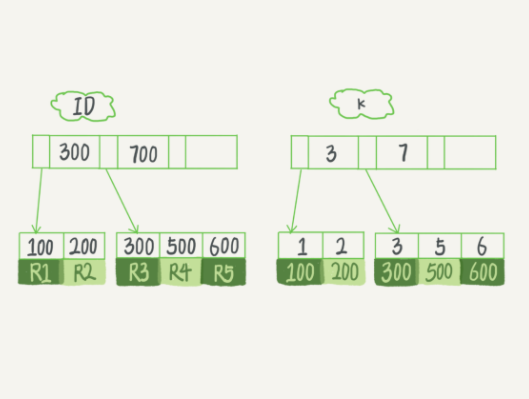

# Mysql实战学习
## 普通索引和唯一索引，应该怎么选择？


从性能的角度考虑，你选择唯一索引还是普通索引呢？从这两种索引对**查询语句**和**更新语句**的性能影响来进行分析
### 查询过程
假设，执行查询的语句是 select id from T where k=5
- 对于普通索引来说，查找到满足条件的第一个记录后，需要查找下一个记录，直到碰到第一个不满足条件的记录
- 对于唯一索引来说，由于索引定义了唯一性，查找到第一个满足条件的记录后，就会停止继续检索。 
  
这个不同带来的性能差距微乎其微，原因是：
- InnoDB 的数据是按数据页为单位来读写的。也就是说，当需要读一条记录的时候，并不是将这个记录本身从磁盘读出来，而是以页为单位，将其整体读入内存。在InnoDB 中，每个数据页的大小默认是 16KB
- 引擎是按页读写的，所以说，当找到 k=5 的记录的时候，它所在的数据页就都在内存里了。那么，对于普通索引来说，要多做的那一次“查找和判断下一条记录”的操作，就只需要一次指针寻找和一次计算

### 更新过程
1. 当需要更新一个数据页时，如果数据页在内存中就直接更新，而如果这个数据页还没有在内存中的话，在不影响数据一致性的前提下，InooDB会将这些更新操作缓存在change buffer中，这样就不需要从磁盘中读入这个数据页了
2. 在下次查询需要访问这个数据页的时候，将数据页读入内存，然后执行 change buffer 中与这个页有关的操作。通过这种方式就能保证这个数据逻辑的正确性
3. 将 change buffer 中的操作应用到原数据页，得到最新结果的过程称为 merge。除了访问这个数据页会触发 merge 外，系统有后台线程会定期 merge。在数据库正常关闭（shutdown）的过程中，也会执行 merge 操作
4. 显然，如果能够将更新操作先记录在 change buffer，减少读磁盘，语句的执行速度会得到明显的提升。而且，数据读入内存是需要占用 buffer pool 的，所以这种方式还能够避免占用内存，提高内存利用率。

什么条件下可以使用 change buffer？
- 对于唯一索引来说，所有的更新操作都要先判断这个操作是否违反唯一性约束，而这必须要将数据页读入内存才能判断。如果都已经读入到内存了，那直接更新内存会更快，就没必要使用 change buffer 了
- 唯一索引的更新就不能使用change buffer，只有普通索引可以使用
- change buffer用的是buffer pool里的内存。change buffer的大小，可以通过参数innodb_change_buffer_max_size来动态设置。这个参数设置为50的时候，表示change buffer的大小最多只能占用buffer pool的50%
- 将数据从磁盘读入内存涉及随机IO的访问，是数据库里面成本最高的操作之一。change buffer因为减少了随机磁盘访问，所以对更新性能的提升是会很明显的

### change buffer的使用场景
- 使用change buffer对更新过程有加速作用
- change buffer只限于用在普通索引的场景下，而不适用于唯一索引
- 对于写多读少的业务来说，页面在写完以后马上被访问到的概率比较小，此时change buffer的使用效果最好
- 如果是写入之后马上会做查询，由于访问数据页会立即触发merge过程。这样随机访问IO的次数不会减少，反而增加了change buffer的维护代价

### 索引选择和实践
1. 在业务能保证唯一性的前提下，尽量使用普通索引
2. 普通索引和 change buffer 的配合使用，对于数据量大的表的更新优化是很明显的

### change buffer和redo log
**更新操作**
```shell
insert into t(id,k) values(id1,k1),(id2,k2)
```
这里，我们假设当前 k 索引树的状态，查找到位置后，k1所在的数据页在内存(InnoDB buffer pool) 中，k2所在的数据页不在内存中


这条更新语句做了如下的操作:
1. Page 1 在内存中，直接更新内存；
2. Page 2 没有在内存中，就在内存的change buffer区域，记录下“我要往 Page 2 插入一行”这个信息
3. 将上述两个动作记入redo log中（图中3和4）。

执行这条更新语句的成本很低，就是写了两处内存，然后写了一处磁盘（两次操作合在一起写了一次磁盘），而且还是顺序写的

**查询操作**
```shell
select * from t where k in (k1, k2)
```
如果读语句发生在更新语句后不久，内存中的数据都还在，那么此时的这两个读操作就与系统表空间（ibdata1）和 redo log（ib_log_fileX）无关了


从图中可以看到：
1. 读 Page 1 的时候，直接从内存返回
2. 要读 Page 2 的时候，需要把 Page 2 从磁盘读入内存中，然后应用change buffer里面的操作日志，生成一个正确的版本并返回结果

**总结**：redo log主要节省的是随机写磁盘的IO消耗（转成顺序写），而change buffer主要节省的则是随机读磁盘的IO消耗

### change buffer会丢失吗
如果某次写入使用了change buffer机制，之后主机异常重启，是否会丢失change buffer和数据？

这个问题的答案是不会丢失。虽然是只更新内存，但是在事务提交的时候，我们把change buffer的操作也记录到redo log里了，所以崩溃恢复的时候，change buffer也能找回来

### merge 的执行流程
1. 从磁盘读入数据页到内存（老版本的数据页）；
2. 从change buffer里找出这个数据页的 change buffer 记录 (可能有多个），依次应用，得到新版数据页；
3. 写redo log。这个redo log包含了数据的变更和change buffer的变更。到这里merge过程就结束了。这时候，数据页和内存中change buffer对应的磁盘位置都还没有修改，属于脏页，之后各自刷回自己的物理数据，就是另外一个过程了。

## MySQL为什么有时候会选错索引？
### 优化器的逻辑
优化器选择索引的目的，是找到一个最优的执行方案，并用最小的代价去执行语句
- 在数据库里面，扫描行数是影响执行代价的因素之一。扫描的行数越少，意味着访问磁盘数据的次数越少，消耗的 CPU 资源越少。
- 扫描行数并不是唯一的判断标准，优化器还会结合是否使用临时表、是否排序等因素进行综合判断

**扫描行数是怎么判断的？**
- 根据统计信息来估算记录数
- 统计信息就是索引的“区分度”。显然，一个索引上不同的值越多，这个索引的区分度就越好。而一个索引上不同的值的个数，我们称之为“基数”（cardinality）
- show index (from table)方法，看到一个索引的基数

**MySQL 是怎样得到索引的基数的呢？**
- 把整张表取出来一行行统计，虽然可以得到精确的结果，但是代价太高了，所以只能选择“采样统计”
- 样统计的时候，InnoDB 默认会选择 N 个数据页，统计这些页面上的不同值，得到一个平均值，然后乘以这个索引的页面数，就得到了这个索引的基数

优化器选择使用哪个索引，除了索引统计的基数外，还需要判断执行这个语句本身要扫描多少行。

可以通过explain查看优化扫描的行数rows。

不是说哪个rows少就会选择哪一个，优化器还会考虑二级索引的回表代价。

analyze table t 命令，可以用来重新统计索引信息。

### 索引选择异常和处理
- 第一种方法是，像我们第一个例子一样，采用 force index 强行选择一个索引
- 第二种方法是，我们可以考虑修改语句，引导 MySQL 使用我们期望的索引
- 第三种方法是，在有些场景下，我们可以新建一个更合适的索引，来提供给优化器做选择，或删掉误用的索引。

## 怎么给字符串字段加索引？
1. 直接创建完整索引，这样可能比较占用空间；
2. 创建前缀索引，节省空间，但会增加查询扫描次数，并且不能使用覆盖索引；
3. 倒序存储，再创建前缀索引，用于绕过字符串本身前缀的区分度不够的问题；
4. 创建 hash 字段索引，查询性能稳定，有额外的存储和计算消耗，跟第三种方式一样，都不支持范围扫描。

## 为什么我的MySQL会“抖”一下？

### 什么是脏页，什么是干净页？
当内存数据页跟磁盘数据页内容不一致的时候，我们称这个内存页为“脏页”。内存数据写入到磁盘后，内存和磁盘上的数据页的内容就一致了，称为“干净页”。

### 什么情况会引发数据库的刷脏页（flush）过程？
1. InnoDB 的 redo log 写满了。这时候系统会停止所有更新操作，把 checkpoint 往前推进，redo log 留出空间可以继续写


把 checkpoint 位置从 CP 推进到 CP’，就需要将两个点之间的日志（浅绿色部分），对应的所有脏页都 flush 到磁盘上。之后，图中从 write pos 到 CP’之间就是可以再写入的 redo log 的区域
2. 系统内存不足。当需要新的内存页，而内存不够用的时候，就要淘汰一些数据页，空出内存给别的数据页使用。如果淘汰的是“脏页”，就要先将脏页写到磁盘
3. MySQL 认为系统“空闲”的时候。
4. MySQL 正常关闭的情况。

### InnoDB刷脏页的控制策略
- flush能力和InnoDB所在主机的IO能力成正比
- innodb_io_capacity参数，告诉 InnoDB 你的磁盘能力，建议你设置成磁盘的 IOPS
磁盘的 IOPS 获取方式：
```shell script
 fio -filename=$filename -direct=1 -iodepth 1 -thread -rw=randrw -ioengine=psync -bs=16k -size=500M -numjobs=10 -runtime=10 -group_reporting -name=mytest 
```
- 合理地设置 innodb_io_capacity 的值，并且平时要多关注脏页比例，不要让它经常接近 75%
脏页比例是通过 Innodb_buffer_pool_pages_dirty/Innodb_buffer_pool_pages_total 得到的，具体的命令参考下面的代码：
```shell script
select VARIABLE_VALUE into @a from global_status where VARIABLE_NAME = 'Innodb_buffer_pool_pages_dirty';
select VARIABLE_VALUE into @b from global_status where VARIABLE_NAME = 'Innodb_buffer_pool_pages_total';
select @a/@b;
```
- 刷一个脏页的时候，如果这个数据页旁边的数据页刚好是脏页，就会把这个“邻居”也带着一起刷掉。在 InnoDB 中，innodb_flush_neighbors 参数就是用来控制这个行为的，值为 1 的时候会有上述的“连坐”机制，值为 0 时表示不找邻居，自己刷自己的

## 为什么表数据删掉一半，表文件大小不变？

### 参数innodb_file_per_table
innodb_file_per_table 控制的：
1. 这个参数设置为 OFF 表示的是，表的数据放在系统共享表空间，也就是跟数据字典放在一起；
2. 这个参数设置为 ON 表示的是，每个 InnoDB 表数据存储在一个以 .ibd 为后缀的文件中。
3. 从 MySQL 5.6.6 版本开始，它的默认值就是 ON 了。

### 数据删除流程
1. 删除数据行或者整个表的数据，并不会让表空间变小，而是将数据行或者数据页标记为可复用
2. 插入数据导致页分裂，也会造成空洞
3. 把这些空洞去掉，就能达到收缩表空间的目的，重建表就能做到

### 重建表
Online DDL重建表的流程：
1. 建立一个临时文件，扫描表 A 主键的所有数据页；
2. 用数据页中表 A 的记录生成 B+ 树，存储到临时文件中；
3. 生成临时文件的过程中，将所有对 A 的操作记录在一个日志文件（row log）中，对应的是图中 state2 的状态；
4. 临时文件生成后，将日志文件中的操作应用到临时文件，得到一个逻辑数据上与表 A 相同的数据文件，对应的就是图中 state3 的状态；
5. 用临时文件替换表 A 的数据文件。


### alter table,analyze table,optimize table的区别
- 从 MySQL 5.6 版本开始，alter table t engine = InnoDB（也就是 recreate）默认的就是上面图 online_ddl 的流程了；
- analyze table t 其实不是重建表，只是对表的索引信息做重新统计，没有修改数据，这个过程中加了 MDL 读锁；
- optimize table t 等于 recreate+analyze。

## count(*)为什么慢？

### count(*) 的实现方式
- MyISAM 引擎把一个表的总行数存在了磁盘上，因此执行 count(*) 的时候会直接返回这个数，效率很高；
- InnoDB 引擎就麻烦了，它执行 count(*) 的时候，需要把数据一行一行地从引擎里面读出来，然后累积计数。
- 如果加了 where 条件的话，MyISAM 表也是不能返回得这么快的

### 为什么 InnoDB 不跟 MyISAM 一样，也把数字存起来呢？
这和 InnoDB 的事务设计有关系，可重复读是它默认的隔离级别，在代码上就是通过多版本并发控制，也就是 MVCC 来实现的。每一行记录都要判断自己是否对这个会话可见，因此对于 count(*) 请求来说，InnoDB 只好把数据一行一行地读出依次判断，可见的行才能够用于计算“基于这个查询”的表的总行数。

- MyISAM 表虽然 count(*) 很快，但是不支持事务；
- show table status 命令虽然返回很快，但是不准确；
- InnoDB 表直接 count(*) 会遍历全表，虽然结果准确，但会导致性能问题。

### 用缓存系统保存计数
- 缓存系统可能会丢失更新
- 缓存系统中的值可能在逻辑上是不精确的
- 需要分布式事务来保障逻辑上的精确性

### 在数据库保存计数
插入或者删除数据可以和计数逻辑放在一个事务中

### 不同的count用法和区别
- count(主键 id)，InnoDB 引擎会遍历整张表，把每一行的 id 值都取出来，返回给 server 层。server 层拿到 id 后，判断是不可能为空的，就按行累加
- count(1)，InnoDB 引擎遍历整张表，但不取值。server 层对于返回的每一行，放一个数字“1”进去，判断是不可能为空的，按行累加。
- count(字段)，还需要额外判断是否为null
- count(*)，并不会把全部字段取出来，而是专门做了优化，不取值
- 按效率排序：count(字段)<count(主键 id)<count(1)≈count(*)

## “order by”是怎么工作的？
表的部分定义：
```shell script
CREATE TABLE `t` (
  `id` int(11) NOT NULL,
  `city` varchar(16) NOT NULL,
  `name` varchar(16) NOT NULL,
  `age` int(11) NOT NULL,
  `addr` varchar(128) DEFAULT NULL,
  PRIMARY KEY (`id`),
  KEY `city` (`city`)
) ENGINE=InnoDB;
```
SQL 语句:
 ```shell script
select city,name,age from t where city='杭州' order by name limit 1000  ;
```

### 全字段排序

explain 命令来看看这个语句的执行情况:


extra 这个字段中的“Using filesort”表示的就是需要排序，MySQL 会给每个线程分配一块内存用于排序，称为 sort_buffer

语句执行流程如下所示:
1. 初始化 sort_buffer，确定放入 name、city、age 这三个字段；
2. 从索引 city 找到第一个满足 city='杭州’条件的主键 id，也就是图中的 ID_X；
3. 到主键 id 索引取出整行，取 name、city、age 三个字段的值，存入 sort_buffer 中；
4. 从索引 city 取下一个记录的主键 id；
5. 重复步骤 3、4 直到 city 的值不满足查询条件为止，对应的主键 id 也就是图中的 ID_Y；
6. 对 sort_buffer 中的数据按照字段 name 做快速排序；
7. 按照排序结果取前 1000 行返回给客户端。


sort_buffer_size，就是 MySQL 为排序开辟的内存（sort_buffer）的大小。如果要排序的数据量小于 sort_buffer_size，排序就在内存中完成。但如果排序数据量太大，内存放不下，则不得不利用磁盘临时文件辅助排序

**如何确定一个排序语句是否使用了临时文件？**
```sql
/* 打开 optimizer_trace，只对本线程有效 */
SET optimizer_trace='enabled=on'; 

/* @a 保存 Innodb_rows_read 的初始值 */
select VARIABLE_VALUE into @a from  performance_schema.session_status where variable_name = 'Innodb_rows_read';
 
/* 执行语句 */
select city, name,age from t where city='杭州' order by name limit 1000; 
 
/* 查看 OPTIMIZER_TRACE 输出 */
SELECT * FROM `information_schema`.`OPTIMIZER_TRACE`\G
 
/* @b 保存 Innodb_rows_read 的当前值 */
select VARIABLE_VALUE into @b from performance_schema.session_status where variable_name = 'Innodb_rows_read';
 
/* 计算 Innodb_rows_read 差值 */
select @b-@a;
```
可以从 number_of_tmp_files 中看到是否使用了临时文件，一般使用归并排序算法

### rowid 排序
MySQL 认为排序的单行长度太大会怎么做呢?
```shell script
SET max_length_for_sort_data = 16;
```
max_length_for_sort_data，是 MySQL 中专门控制用于排序的行数据的长度的一个参数。它的意思是，如果单行的长度超过这个值，MySQL 就认为单行太大，要换一个算法

新的算法放入 sort_buffer 的字段，只有要排序的列（即 name 字段）和主键 id

流程就变成如下所示:
1. 初始化 sort_buffer，确定放入两个字段，即 name 和 id；
2. 从索引 city 找到第一个满足 city='杭州’条件的主键 id，也就是图中的 ID_X；
3. 到主键 id 索引取出整行，取 name、id 这两个字段，存入 sort_buffer 中；
4. 从索引 city 取下一个记录的主键 id；
5. 重复步骤 3、4 直到不满足 city='杭州’条件为止，也就是图中的 ID_Y；
6. 对 sort_buffer 中的数据按照字段 name 进行排序；
7. 遍历排序结果，取前 1000 行，并按照 id 的值回到原表中取出 city、name 和 age 三个字段返回给客户端。


### 全字段排序 VS rowid 排序
- 如果 MySQL 实在是担心排序内存太小，会影响排序效率，才会采用 rowid 排序算法，这样排序过程中一次可以排序更多行，但是需要再回到原表去取数据
- 如果 MySQL 认为内存足够大，会优先选择全字段排序，把需要的字段都放到 sort_buffer 中，这样排序后就会直接从内存里面返回查询结果了，不用再回到原表去取数据

### 如何优化sql减少排序的操作
1. 创建联合索引，使数据天然有序
```sql
alter table t add index city_user(city, name);
```
2. 使用覆盖索引，进一步避免回表
```sql
alter table t add index city_user_age(city, name, age);
```

### 案例
这个英语学习 App 首页有一个随机显示单词的功能，也就是根据每个用户的级别有一个单词表，然后这个用户每次访问首页的时候，都会随机滚动显示三个单词。他们发现随着单词表变大，选单词这个逻辑变得越来越慢，甚至影响到了首页的打开速度。

现在，如果让你来设计这个 SQL 语句，你会怎么写呢？

为了便于理解，我对这个例子进行了简化：去掉每个级别的用户都有一个对应的单词表这个逻辑，直接就是从一个单词表中随机选出三个单词。这个表的建表语句和初始数据的命令如下：
```sql
mysql> CREATE TABLE `words` (
  `id` int(11) NOT NULL AUTO_INCREMENT,
  `word` varchar(64) DEFAULT NULL,
  PRIMARY KEY (`id`)
) ENGINE=InnoDB;
 
delimiter ;;
create procedure idata()
begin
  declare i int;
  set i=0;
  while i<10000 do
    insert into words(word) values(concat(char(97+(i div 1000)), char(97+(i % 1000 div 100)), char(97+(i % 100 div 10)), char(97+(i % 10))));
    set i=i+1;
  end while;
end;;
delimiter ;
 
call idata();
```

**内存临时表**
```sql
mysql> select word from words order by rand() limit 3;
```
虽然这个 SQL 语句写法很简单，但执行流程却有点复杂的。通过explain命令来看看这个语句的执行情况，Extra 字段显示 Using temporary，表示的是需要使用临时表；Using filesort，表示的是需要执行排序操作。

这条语句的执行流程是这样的：
1. 创建一个临时表。这个临时表使用的是 memory 引擎，表里有两个字段，第一个字段是 double 类型，为了后面描述方便，记为字段 R，第二个字段是 varchar(64) 类型，记为字段 W。并且，这个表没有建索引。
2. 从 words 表中，按主键顺序取出所有的 word 值。对于每一个 word 值，调用 rand() 函数生成一个大于 0 小于 1 的随机小数，并把这个随机小数和 word 分别存入临时表的 R 和 W 字段中，到此，扫描行数是 10000。
3. 现在临时表有 10000 行数据了，接下来你要在这个没有索引的内存临时表上，按照字段 R 排序。
4. 初始化 sort_buffer。sort_buffer 中有两个字段，一个是 double 类型，另一个是整型。
5. 从内存临时表中一行一行地取出 R 值和位置信息（我后面会和你解释这里为什么是“位置信息”），分别存入 sort_buffer 中的两个字段里。这个过程要对内存临时表做全表扫描，此时扫描行数增加 10000，变成了 20000。
6. 在 sort_buffer 中根据 R 的值进行排序。注意，这个过程没有涉及到表操作，所以不会增加扫描行数。
7. 排序完成后，取出前三个结果的位置信息，依次到内存临时表中取出 word 值，返回给客户端。这个过程中，访问了表的三行数据，总扫描行数变成了 20003。


通过上面的分析：通过order by rand()过程是比较复杂的，性能不高，那如何优化呢？

**随机排序方法1：**
1. 取得这个表的主键 id 的最大值 M 和最小值 N;
2. 用随机函数生成一个最大值到最小值之间的数 X = (M-N)*rand() + N;
3. 取不小于 X 的第一个 ID 的行。
```sql
mysql> select max(id),min(id) into @M,@N from t ;
set @X= floor((@M-@N+1)*rand() + @N);
select * from t where id >= @X limit 1;
```
这个方法效率很高，因为取 max(id) 和 min(id) 都是不需要扫描索引的，而第三步的 select 也可以用索引快速定位，可以认为就只扫描了 3 行。但实际上，这个算法本身并不严格满足题目的随机要求，因为 ID 中间可能有空洞，因此选择不同行的概率不一样，不是真正的随机

**随机排序方法2：**
1. 取得整个表的行数，并记为 C。
2. 取得 Y = floor(C * rand())。 floor 函数在这里的作用，就是取整数部分。
3. 再用 limit Y,1 取得一行。
```sql
mysql> select count(*) into @C from t;
set @Y1 = floor(@C * rand());
set @Y2 = floor(@C * rand());
set @Y3 = floor(@C * rand());
select * from t limit @Y1,1; // 在应用代码里面取 Y1、Y2、Y3 值，拼出 SQL 后执行
select * from t limit @Y2,1;
select * from t limit @Y3,1;
```

**优化后的方法3：**
1. 随机出Y1、Y2、Y3后，算出Ymax、Ymin
2. 再用 select id from t limit Ymin，(Ymax - Ymin)
3. 得到id集后算出Y1、Y2、Y3对应的三个id
4. 最后 select * from t where id in (id1, id2, id3)

## 为什么这些SQL语句逻辑相同，性能却差异巨大？

### 案例一：条件字段函数操作
建表语句：
```sql
mysql> CREATE TABLE `tradelog` (
  `id` int(11) NOT NULL,
  `tradeid` varchar(32) DEFAULT NULL,
  `operator` int(11) DEFAULT NULL,
  `t_modified` datetime DEFAULT NULL,
  PRIMARY KEY (`id`),
  KEY `tradeid` (`tradeid`),
  KEY `t_modified` (`t_modified`)
) ENGINE=InnoDB DEFAULT CHARSET=utf8mb4;
```
需求：假设，现在已经记录了从 2016 年初到 2018 年底的所有数据，运营部门有一个需求是，要统计发生在所有年份中 7 月份的交易记录总数
```sql
mysql> select count(*) from tradelog where month(t_modified)=7;
```
上述sql语句无法用到t_modified的索引，因为**对索引字段做函数操作，可能会破坏索引值的有序性，因此优化器就决定放弃走树搜索功能**

需要改写为：
```sql
mysql> select count(*) from tradelog where
    -> (t_modified >= '2016-7-1' and t_modified<'2016-8-1') or
    -> (t_modified >= '2017-7-1' and t_modified<'2017-8-1') or 
    -> (t_modified >= '2018-7-1' and t_modified<'2018-8-1');
```

### 案例二：隐式类型转换
```sql
mysql> select * from tradelog where tradeid=110717;
```
tradeid 这个字段上有索引，但是tradeid 的字段类型是 varchar(32)，而输入的参数却是整型，所以需要做类型转换

对于优化器来说，这个语句相当于：
```sql
mysql> select * from tradelog where  CAST(tradid AS signed int) = 110717;
```

### 案例三：隐式字符编码转换
```sql
mysql> CREATE TABLE `trade_detail` (
  `id` int(11) NOT NULL,
  `tradeid` varchar(32) DEFAULT NULL,
  `trade_step` int(11) DEFAULT NULL, /* 操作步骤 */
  `step_info` varchar(32) DEFAULT NULL, /* 步骤信息 */
  PRIMARY KEY (`id`),
  KEY `tradeid` (`tradeid`)
) ENGINE=InnoDB DEFAULT CHARSET=utf8;
 
insert into tradelog values(1, 'aaaaaaaa', 1000, now());
insert into tradelog values(2, 'aaaaaaab', 1000, now());
insert into tradelog values(3, 'aaaaaaac', 1000, now());
 
insert into trade_detail values(1, 'aaaaaaaa', 1, 'add');
insert into trade_detail values(2, 'aaaaaaaa', 2, 'update');
insert into trade_detail values(3, 'aaaaaaaa', 3, 'commit');
insert into trade_detail values(4, 'aaaaaaab', 1, 'add');
insert into trade_detail values(5, 'aaaaaaab', 2, 'update');
insert into trade_detail values(6, 'aaaaaaab', 3, 'update again');
insert into trade_detail values(7, 'aaaaaaab', 4, 'commit');
insert into trade_detail values(8, 'aaaaaaac', 1, 'add');
insert into trade_detail values(9, 'aaaaaaac', 2, 'update');
insert into trade_detail values(10, 'aaaaaaac', 3, 'update again');
insert into trade_detail values(11, 'aaaaaaac', 4, 'commit');
```
如果要查询 id=2 的交易的所有操作步骤信息，SQL 语句可以这么写：
```sql
mysql> select d.* from tradelog l, trade_detail d where d.tradeid=l.tradeid and l.id=2; 
```
因为这两个表的字符集不同，一个是 utf8，一个是 utf8mb4，所以做表连接查询的时候用不上关联字段的索引，也就是说，实际上这个语句等同于下面这个写法
```sql
select * from trade_detail  where CONVERT(traideid USING utf8mb4)=$L2.tradeid.value; 
```
优化方案1：把 trade_detail 表上的 tradeid 字段的字符集也改成 utf8mb4
```sql
alter table trade_detail modify tradeid varchar(32) CHARACTER SET utf8mb4 default null;
```
优化方案2：修改 SQL 语句的方法
```sql
mysql> select d.* from tradelog l , trade_detail d where d.tradeid=CONVERT(l.tradeid USING utf8) and l.id=2;
```

### 总结
对索引字段做函数操作，可能会破坏索引值的有序性，因此优化器就决定放弃走树搜索功能

## 幻读是什么，幻读有什么问题？
```sql
CREATE TABLE `t` (
  `id` int(11) NOT NULL,
  `c` int(11) DEFAULT NULL,
  `d` int(11) DEFAULT NULL,
  PRIMARY KEY (`id`),
  KEY `c` (`c`)
) ENGINE=InnoDB;
 
insert into t values(0,0,0),(5,5,5),
(10,10,10),(15,15,15),(20,20,20),(25,25,25);
```

### 幻读是什么？

1. Q1 只返回 id=5 这一行；
2. 在 T2 时刻，session B 把 id=0 这一行的 d 值改成了 5，因此 T3 时刻 Q2 查出来的是 id=0 和 id=5 这两行；
3. 在 T4 时刻，session C 又插入一行（1,1,5），因此 T5 时刻 Q3 查出来的是 id=0、id=1 和 id=5 的这三行。
其中，Q3 读到 id=1 这一行的现象，被称为“幻读”。也就是说，幻读指的是一个事务在前后两次查询同一个范围的时候，后一次查询看到了前一次查询没有看到的行。
幻读仅专指“新插入的行”。

### 幻读有什么问题？
1. 首先是语义上的。session A 在 T1 时刻就声明了，“我要把所有 d=5 的行锁住，不准别的事务进行读写操作”。而实际上，这个语义被破坏了
2. 其次，是数据一致性的问题。这个一致性，不止是数据库内部数据状态在此刻的一致性，还包含了数据和日志在逻辑上的一致性
3. 也就是说，即使把所有的记录都加上锁，还是阻止不了新插入的记录，这也是为什么“幻读”会被单独拿出来解决的原因

### 如何解决幻读？
产生幻读的原因是，行锁只能锁住行，但是新插入记录这个动作，要更新的是记录之间的“间隙”。因此，为了解决幻读问题，InnoDB 只好引入新的锁，也就是间隙锁 (Gap Lock)。

隙锁，锁的就是两个值之间的空隙。比如文章开头的表 t，初始化插入了 6 个记录，这就产生了 7 个间隙


当你执行 select * from t where d=5 for update 的时候，就不止是给数据库中已有的 6 个记录加上了行锁，还同时加了 7 个间隙锁。这样就确保了无法再插入新的记录。

间隙锁和行锁合称 next-key lock，每个 next-key lock 是前开后闭区间。

**跟间隙锁存在冲突关系的，是“往这个间隙中插入一个记录”这个操作**。间隙锁之间都不存在冲突关系。

### 引入间隙锁带来的问题？
间隙锁和 next-key lock 的引入，帮我们解决了幻读的问题，但同时也带来了一些“困扰”。**间隙锁可能带来死锁**。
```sql
begin;
select * from t where id=N for update;
 
/* 如果行不存在 */
insert into t values(N,N,N);
/* 如果行存在 */
update t set d=N set id=N;
 
commit;
```

1. session A 执行 select … for update 语句，由于 id=9 这一行并不存在，因此会加上间隙锁 (5,10);
2. session B 执行 select … for update 语句，同样会加上间隙锁 (5,10)，间隙锁之间不会冲突，因此这个语句可以执行成功；
3. session B 试图插入一行 (9,9,9)，被 session A 的间隙锁挡住了，只好进入等待；
4. session A 试图插入一行 (9,9,9)，被 session B 的间隙锁挡住了。
至此，两个 session 进入互相等待状态，形成死锁

间隙锁的引入，可能会导致同样的语句锁住更大的范围，这其实是影响了并发度的

### 如何避免间隙锁？
- 间隙锁是在可重复读隔离级别下才会生效的
- 把隔离级别设置为读提交的话，就没有间隙锁了。但同时，你要解决可能出现的数据和日志不一致问题，需要把 binlog 格式设置为 row（binlog_format=row）

## 加锁规则
加锁规则里面，包含了两个“原则”、两个“优化”和一个“bug”
- 原则 1：加锁的基本单位是 next-key lock。希望你还记得，next-key lock 是前开后闭区间。
- 原则 2：查找过程中访问到的对象才会加锁。
- 优化 1：索引上的等值查询，给唯一索引加锁的时候，next-key lock 退化为行锁。
- 优化 2：索引上的等值查询，向右遍历时且最后一个值不满足等值条件的时候，next-key lock 退化为间隙锁。
- 一个 bug：唯一索引上的范围查询会访问到不满足条件的第一个值为止。

```sql
CREATE TABLE `t` (
  `id` int(11) NOT NULL,
  `c` int(11) DEFAULT NULL,
  `d` int(11) DEFAULT NULL,
  PRIMARY KEY (`id`),
  KEY `c` (`c`)
) ENGINE=InnoDB;
 
insert into t values(0,0,0),(5,5,5),(10,10,10),(15,15,15),(20,20,20),(25,25,25);
```
### 案例一：等值查询间隙锁


1. 根据原则 1，加锁单位是 next-key lock，session A 加锁范围就是 (5,10]；
2. 同时根据优化 2，这是一个等值查询 (id=7)，而 id=10 不满足查询条件，next-key lock 退化成间隙锁，因此最终加锁的范围是 (5,10)。

### 案例二：非唯一索引等值锁


1. 根据原则 1，加锁单位是 next-key lock，因此会给 (0,5] 加上 next-key lock。
2. 要注意 c 是普通索引，因此仅访问 c=5 这一条记录是不能马上停下来的，需要向右遍历，查到 c=10 才放弃。根据原则 2，访问到的都要加锁，因此要给 (5,10] 加 next-key lock。
3. 但是同时这个符合优化 2：等值判断，向右遍历，最后一个值不满足 c=5 这个等值条件，因此退化成间隙锁 (5,10)。
4. 根据原则 2 ，只有访问到的对象才会加锁，这个查询使用覆盖索引，并不需要访问主键索引，所以主键索引上没有加任何锁，这就是为什么 session B 的 update 语句可以执行完成。

在这个例子中，lock in share mode 只锁覆盖索引，但是如果是 for update 就不一样了。 执行 for update 时，系统会认为你接下来要更新数据，因此会顺便给主键索引上满足条件的行加上行锁

这个例子说明，锁是加在索引上的；同时，它给我们的指导是，如果你要用 lock in share mode 来给行加读锁避免数据被更新的话，就必须得绕过覆盖索引的优化，在查询字段中加入索引中不存在的字段

### 案例三：主键索引范围锁


1. 开始执行的时候，要找到第一个 id=10 的行，因此本该是 next-key lock(5,10]。 根据优化 1， 主键 id 上的等值条件，退化成行锁，只加了 id=10 这一行的行锁。
2. 范围查找就往后继续找，找到 id=15 这一行停下来，因此需要加 next-key lock(10,15]。

这里你需要注意一点，首次 session A 定位查找 id=10 的行的时候，是当做等值查询来判断的，而向右扫描到 id=15 的时候，用的是范围查询判断

### 案例四：非唯一索引范围锁


这次 session A 用字段 c 来判断，加锁规则跟案例三唯一的不同是：在第一次用 c=10 定位记录的时候，索引 c 上加了 (5,10] 这个 next-key lock 后，由于索引 c 是非唯一索引，没有优化规则，也就是说不会蜕变为行锁，因此最终 sesion A 加的锁是，索引 c 上的 (5,10] 和 (10,15] 这两个 next-key lock

### 案例五：唯一索引范围锁 bug


session A 是一个范围查询，按照原则 1 的话，应该是索引 id 上只加 (10,15] 这个 next-key lock，并且因为 id 是唯一键，所以循环判断到 id=15 这一行就应该停止了。

但是实现上，InnoDB 会往前扫描到第一个不满足条件的行为止，也就是 id=20。而且由于这是个范围扫描，因此索引 id 上的 (15,20] 这个 next-key lock 也会被锁上。

照理说，这里锁住 id=20 这一行的行为，其实是没有必要的。因为扫描到 id=15，就可以确定不用往后再找了。但实现上还是这么做了，因此我认为这是个 bug。

### 案例六：非唯一索引上存在"等值"的例子
为了更好地说明“间隙”这个概念，给表 t 插入一条新记录
```sql
mysql> insert into t values(30,10,30);
```
delete 语句加锁的逻辑，其实跟 select ... for update 是类似的


session A 在遍历的时候，先访问第一个 c=10 的记录。同样地，根据原则 1，这里加的是 (c=5,id=5) 到 (c=10,id=10) 这个 next-key lock。

然后，session A 向右查找，直到碰到 (c=15,id=15) 这一行，循环才结束。根据优化 2，这是一个等值查询，向右查找到了不满足条件的行，所以会退化成 (c=10,id=10) 到 (c=15,id=15) 的间隙锁。

### 案例七：limit 语句加锁
案例六的一个对照案例


这个例子里，session A 的 delete 语句加了 limit 2。你知道表 t 里 c=10 的记录其实只有两条，因此加不加 limit 2，删除的效果都是一样的，但是加锁的效果却不同。

这是因为，案例七里的 delete 语句明确加了 limit 2 的限制，因此在遍历到 (c=10, id=30) 这一行之后，满足条件的语句已经有两条，循环就结束了

因此，索引 c 上的加锁范围就变成了从（c=5,id=5) 到（c=10,id=30) 这个前开后闭区间

这个例子对我们实践的指导意义就是，在删除数据的时候尽量加 limit。

### 案例八：一个死锁的例子


1. session A 启动事务后执行查询语句加 lock in share mode，在索引 c 上加了 next-key lock(5,10] 和间隙锁 (10,15)；
2. session B 的 update 语句也要在索引 c 上加 next-key lock(5,10] ，进入锁等待；
3. 然后 session A 要再插入 (8,8,8) 这一行，被 session B 的间隙锁锁住。由于出现了死锁，InnoDB 让 session B 回滚。

session B 的“加next-key lock(5,10]”操作，实际上分成了两步，先是加 (5,10) 的间隙锁，加锁成功；然后加 c=10 的行锁，这时候才被锁住的

我们在分析加锁规则的时候可以用 next-key lock 来分析。但是要知道，具体执行的时候，是要分成间隙锁和行锁两段来执行的
