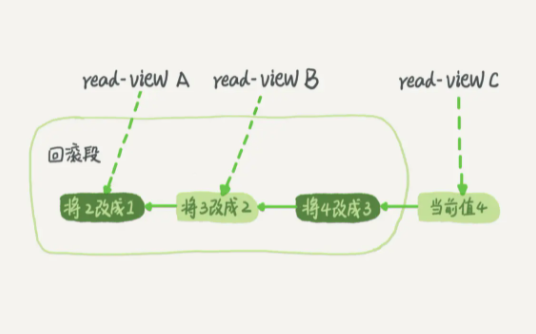

#Mysql理论基础学习


MySQL 可以分为 Server 层和存储引擎层两部分

##一条SQL查询语句是如何执行的？
###连接器
连接器负责跟客户端建立连接、获取权限、维持和管理连接
```shell
mysql -h$ip -P$port -u$user -p
```
###查询缓存
MySQL 拿到一个查询请求后，会先到查询缓存看看，之前是不是执行过这条语句。之前执行过的语句及其结果可能会以 key-value 对的形式，被直接缓存在内存中。

**大多数情况下我会建议你不要使用查询缓存，为什么呢？因为查询缓存往往弊大于利**

查询缓存的失效非常频繁，只要有对一个表的更新，这个表上所有的查询缓存都会被清空

需要注意的是，**MySQL 8.0 版本直接将查询缓存的整块功能删掉了**，也就是说 8.0 开始彻底没有这个功能了。

###分析器
- 分析器先会做“词法分析”，识别字符串的含义
- 识别以后就要做“语法分析”，判断是否满足mysql的语法

###优化器
优化器通过多种因素（使用的索引，join表的顺序等）决定使用效率高的一种执行方案

###执行器
MySQL 通过分析器知道了你要做什么，通过优化器知道了该怎么做

执行器在执行前会先进行权限校验，对表有执行权限才开始执行

##一条SQL更新语句是如何执行的？
与查询流程不一样的是，更新流程还涉及两个重要的日志模块，它们正是我们今天要讨论的主角：redo log（重做日志）和 binlog（归档日志）

###重要的日志模块：redo log
如果每一次的更新操作都需要写进磁盘，然后磁盘也要找到对应的那条记录，然后再更新，整个过程 IO 成本、查找成本都很高。为了解决这个问题，MySQL 的设计者就用了类似酒店掌柜粉板的思路来提升更新效率。

而粉板和账本配合的整个过程，其实就是 MySQL 里经常说到的 WAL 技术，WAL 的全称是 Write-Ahead Logging，它的关键点就是先写日志，再写磁盘，也就是先写粉板，等不忙的时候再写账本。

InnoDB 的 redo log 是固定大小的，比如可以配置为一组 4 个文件，每个文件的大小是 1GB，那么这块“粉板”总共就可以记录 4GB 的操作。从头开始写，写到末尾就又回到开头循环写，如下面这个图所示


write pos 是当前记录的位置，一边写一边后移，写到第 3 号文件末尾后就回到 0 号文件开头。checkpoint 是当前要擦除的位置，也是往后推移并且循环的，擦除记录前要把记录更新到数据文件

write pos 和 checkpoint 之间还空着的部分，可以用来记录新的操作。如果 write pos 追上 checkpoint，表示满了，这时候不能再执行新的更新，得停下来先擦掉一些记录，把 checkpoint 推进一下

**有了 redo log，InnoDB 就可以保证即使数据库发生异常重启，之前提交的记录都不会丢失，这个能力称为 crash-safe。**

###重要的日志模块：binlog
为什么会有两份日志呢？

因为最开始 MySQL 里并没有 InnoDB 引擎。MySQL 自带的引擎是 MyISAM，但是 MyISAM 没有 crash-safe 的能力，binlog 日志只能用于归档。而 InnoDB 是另一个公司以插件形式引入 MySQL 的，既然只依靠 binlog 是没有 crash-safe 能力的，所以 InnoDB 使用另外一套日志系统——也就是 redo log 来实现 crash-safe 能力。

这两种日志有以下三点不同:
- redo log是InnoDB引擎特有的；binlog是MySQL的Server层实现的，所有引擎都可以使用。
- redo log是物理日志，记录的是“在某个数据页上做了什么修改”；binlog 是逻辑日志，记录的是这个语句的原始逻辑，比如“给 ID=2 这一行的 c 字段加 1 ”。
- redo log是循环写的，空间固定会用完；binlog 是可以追加写入的。“追加写”是指 binlog 文件写到一定大小后会切换到下一个，并不会覆盖以前的日志。

执行器和 InnoDB 引擎在执行这个简单的 update 语句时的内部流程
```shell
update T set c=c+1 where ID=2;
```
1. 执行器先找引擎取 ID=2 这一行。ID 是主键，引擎直接用树搜索找到这一行。如果 ID=2 这一行所在的数据页本来就在内存中，就直接返回给执行器；否则，需要先从磁盘读入内存，然后再返回
2. 执行器拿到引擎给的行数据，把这个值加上 1，比如原来是 N，现在就是 N+1，得到新的一行数据，再调用引擎接口写入这行新数据
3. 引擎将这行新数据更新到内存中，同时将这个更新操作记录到redo log里面，此时redo log处于prepare状态。然后告知执行器执行完成了，随时可以提交事务
4. 执行器生成这个操作的binlog，并把binlog写入磁盘。
5. 执行器调用引擎的提交事务接口，引擎把刚刚写入的redo log改成提交（commit）状态，更新完成。

update 语句的执行流程图:


###两阶段提交
将 redo log 的写入拆成了两个步骤：prepare 和 commit，这就是"两阶段提交"

为什么必须有“两阶段提交”呢？这是为了让两份日志之间的逻辑一致

无论是先写redolog后写binlog，还是先写binlog再写redolog，如果不使用“两阶段提交”，那么数据库的状态就有可能和用它的日志恢复出来的库的状态不一致

当你需要扩容的时候，也就是需要再多搭建一些备库来增加系统的读能力的时候，现在常见的做法也是用全量备份加上应用 binlog 来实现的，这个“不一致”就会导致你的线上出现主从数据库不一致的情况

##事务隔离
###事务的特性
原子性、一致性、隔离性、持久性
###多事务同时执行会出现的问题
脏读、不可重复读、幻读
###事务隔离级别
读未提交、读提交、可重复读、串行化
###不同事务隔离级别的区别
- 读未提交：一个事务还未提交，它所做的变更就可以被别的事务看到
- 读提交：一个事务提交之后，它所做的变更才可以被别的事务看到
- 可重复读：一个事务执行过程中看到的数据是一致的。未提交的更改对其他事务是不可见的
- 串行化：对应一个记录会加读写锁，出现冲突的时候，后访问的事务必须等前一个事务执行完成才能继续执行
- 配置方法：启动参数transaction-isolation
###事务隔离的实现
每条记录在更新的时候都会同时记录一条回滚操作。同一条记录在系统中可以存在多个版本，这就是数据库的多版本并发控制（MVCC）。

在 MySQL 中，实际上每条记录在更新的时候都会同时记录一条回滚操作。记录上的最新值，通过回滚操作，都可以得到前一个状态的值

假设一个值从 1 被按顺序改成了 2、3、4，在回滚日志里面就会有类似下面的记录



当前值是 4，但是在查询这条记录的时候，不同时刻启动的事务会有不同的 read-view。如图中看到的，在视图 A、B、C 里面，这一个记录的值分别是 1、2、4，同一条记录在系统中可以存在多个版本，就是数据库的多版本并发控制（MVCC）。对于 read-view A，要得到 1，就必须将当前值依次执行图中所有的回滚操作得到。

同时你会发现，即使现在有另外一个事务正在将 4 改成 5，这个事务跟 read-view A、B、C 对应的事务是不会冲突的。
###回滚日志什么时候删除？
系统会判断当没有事务需要用到这些回滚日志的时候，回滚日志会被删除。即**当系统里没有比这个回滚日志更早的read-view的时候**。
###为什么尽量不要使用长事务
长事务意味着系统里面会存在很老的事务视图，在这个事务提交之前，回滚记录都要保留，这会导致大量占用存储空间。除此之外，长事务还占用锁资源，可能会拖垮库。
###事务的启动方式
1. 显式启动事务语句，begin或者start transaction,提交commit，回滚rollback
2. set autocommit=0，该命令会把这个线程的自动提交关掉。这样只要执行一个select语句，事务就启动，并不会自动提交，直到主动执行commit或rollback或断开连接。
建议使用方法一，如果考虑多一次交互问题，可以使用commit work and chain语法。在autocommit=1的情况下用begin显式启动事务，如果执行commit则提交事务。如果执行commit work and chain则提交事务并自动启动下一个事务。
   
##深入浅出索引（上）
###索引的常见模型
- 哈希表：这种结构适用于只有等值查询的场景，比如 Memcached 及其他一些 NoSQL 引擎
- 有序数组：有序数组在等值查询和范围查询场景中的性能就都非常优秀（log2N），但插入数据的成本高，有序数组索引只适用于静态存储引擎
- 二叉搜索树：查询和插入的时间复杂度都是log2N，但数据量大时会造成树的高度过高，存储磁盘后，访问的成本过高（每访问一个数据块需要10ms左右的磁盘寻址时间，如果树高20，访问一个数据就需要200ms）
- N叉树（B+树）：以 InnoDB 的一个整数字段索引为例，这个 N 差不多是 1200。这棵树高是 4 的时候，就可以存 1200 的 3 次方个值，这已经 17 亿了。考虑到树根的数据块总是在内存中的，一个 10 亿行的表上一个整数字段的索引，查找一个值最多只需要访问 3 次磁盘
###InnoDB的索引模型
在 InnoDB 中，表都是根据主键顺序以索引的形式存放的，这种存储方式的表称为索引组织表。InnoDB使用了B+树索引模型，所以数据都是存储在B+树中的，每一个索引在InnoDB里面对应一棵B+树
```shell
create table T(id int primary key, k int not null, name varchar(16),index (k))engine=InnoDB;
```
表中 R1~R5 的 (ID,k) 值分别为 (100,1)、(200,2)、(300,3)、(500,5) 和 (600,6)，两棵树的示例示意图如下


- 主键索引的叶子节点存的是整行数据。在 InnoDB 里，主键索引也被称为聚簇索引（clustered index）
- 非主键索引的叶子节点内容是主键的值。在 InnoDB 里，非主键索引也被称为二级索引（secondary index）

**基于主键索引和普通索引的查询有什么区别？**
- 如果语句是 select * from T where ID=500，即主键查询方式，则只需要搜索 ID 这棵 B+ 树；
- 如果语句是 select * from T where k=5，即普通索引查询方式，则需要先搜索 k 索引树，得到 ID 的值为 500，再到 ID 索引树搜索一次。这个过程称为回表。
###索引维护
一个数据页满了，按照B+Tree算法，新增加一个数据页，叫做页分裂，会导致性能下降。空间利用率降低大概50%。当相邻的两个数据页利用率很低的时候会做数据页合并，合并的过程是分裂过程的逆过程

从性能和存储空间方面考量，自增主键往往是更合理的选择
- 主键长度越小，普通索引的叶子节点就越小，普通索引占用的空间也就越小
- 自增主键的插入数据模式，正符合了我们前面提到的递增插入的场景。每次插入一条新记录，都是追加操作，都不涉及到挪动其他记录，能够减少触发叶子节点的分裂的情况

##深入浅出索引（下）
###覆盖索引
二级索引树上的数据包含了需要查询的结果，不需要再回表，就是覆盖索引

由于覆盖索引可以减少树的搜索次数，显著提升查询性能，所以使用覆盖索引是一个常用的性能优化手段
###最左前缀原则
B+树这种索引结构，可以利用索引的“最左前缀”，来定位记录。

不只是索引的全部定义，只要满足最左前缀，就可以利用索引来加速检索。这个最左前缀可以是联合索引的最左 N 个字段，也可以是字符串索引的最左 M 个字符

在建立联合索引的时候，如何安排索引内的字段顺序？
- 第一原则是，如果通过调整顺序，可以少维护一个索引，那么这个顺序往往就是需要优先考虑采用的
- 其次就是考虑建立多个索引需要的存储空间
###索引下推
```shell
# 建表语句
CREATE TABLE `tuser` (
 `id` int(11) NOT NULL,
 `id_card` varchar(32) DEFAULT NULL,
 `name` varchar(32) DEFAULT NULL,
 `age` int(11) DEFAULT NULL,
 `ismale` tinyint(1) DEFAULT NULL,
 PRIMARY KEY (`id`),
 KEY `id_card` (`id_card`),
 KEY `name_age` (`name`,`age`)
) ENGINE=InnoDB
# 查询语句
 select * from tuser where name like '张 %' and age=10 and ismale=1;
```
在 MySQL 5.6 之前，只能通过从二级索引开始一个个回表。到主键索引上找出数据行，再对比字段值；而 MySQL 5.6 引入的索引下推优化（index condition pushdown)， 可以在索引遍历过
程中，对索引中包含的字段先做判断，直接过滤掉不满足条件的记录，减少回表次数。

无索引下推：


索引下推：


##全局锁和表锁
根据加锁的范围，MySQL 里面的锁大致可以分成全局锁、表级锁和行锁三类
###全局锁
全局锁就是对整个数据库实例加锁，命令是 Flush tables with read lock (FTWRL)

其他线程以下语句会被阻塞：
- 数据更新语句（数据的增删改）
- 数据定义语句（包括建表、修改表结构等）
- 更新类事务的提交语句

**全局锁的典型使用场景是，做全库逻辑备份**

全局锁的问题：
- 如果你在主库上备份，那么在备份期间都不能执行更新，业务基本上就得停摆；
- 如果你在从库上备份，那么备份期间从库不能执行主库同步过来的 binlog，会导致主从延迟。

如何优化全局锁？
- 在可重复读隔离级别下开启一个事务
- 一致性读是好，但前提是引擎要支持这个隔离级别（MyISAM不支持、innoDB支持）
- 官方自带的逻辑备份工具是 mysqldump。当 mysqldump 使用参数–single-transaction的时候，导数据之前就会启动一个事务，来确保拿到一致性视图。而由于MVCC的支持，这个过程中数据是可以正常更新的
- single-transaction 方法只适用于所有的表使用事务引擎的库

**既然要全库只读，为什么不使用set global readonly=true的方式呢？**
- 在有些系统中，readonly的值会被用来做其他逻辑，比如用来判断一个库是主库还是备库。因此，修改 global 变量的方式影响面更大，我不建议你使用
- 在异常处理机制上有差异。如果执行FTWRL命令之后由于客户端发生异常断开，那么MySQL会自动释放这个全局锁，整个库回到可以正常更新的状态。而将整个库设置为readonly之后，如果客户端发生异常，则数据库就会一直保持readonly状态，这样会导致整个库长时间处于不可写状态，风险较高
###表级锁
MySQL 里面表级别的锁有两种：一种是表锁，一种是元数据锁（meta data lock， MDL)。

表锁的语法是 lock tables … read/write。与 FTWRL 类似，可以用 unlock tables 主动释放锁，也可以在客户端断开的时候自动释放

另一类表级的锁是 MDL（metadata lock)。MDL不需要显式使用，在访问一个表的时候会被自动加上。

MDL的作用是，保证读写的正确性。你可以想象一下，如果一个查询正在遍历一个表中的数据，而执行期间另一个线程对这个表结构做变更，删了一列，那么查询线程拿到的结果跟表结构对不上，肯定是不行的

在MySQL 5.5 版本中引入了MDL：
- 当对一个表做增删改查操作的时候，加MDL读锁
- 当要对表做结构变更操作的时候，加MDL写锁
- 读锁之间不互斥，因此你可以有多个线程同时对一张表增删改查
- 读写锁之间、写锁之间是互斥的，用来保证变更表结构操作的安全性

##InnoDB行锁
###两阶段锁
在 InnoDB 事务中，行锁是在需要的时候才加上的，但并不是不需要了就立刻释放，而是要等到事务结束时才释放。这个就是两阶段锁协议

如果你的事务中需要锁多个行，要把最可能造成锁冲突、最可能影响并发度的锁尽量往后放
###死锁和死锁检测
当并发系统中不同线程出现循环资源依赖，涉及的线程都在等待别的线程释放资源时，就会导致这几个线程都进入无限等待的状态，称为死锁


当出现死锁以后，有两种策略:
- 直接进入等待，直到超时。这个超时时间可以通过参数 innodb_lock_wait_timeout 来设置，默认是50s
- 发起死锁检测，发现死锁后，主动回滚死锁链条中的某一个事务，让其他事务得以继续执行。将参数innodb_deadlock_detect设置为on，表示开启这个逻辑，默认为on

正常情况下我们使用**死锁检测策略**，但是它也是有额外负担的

每个新来的被堵住的线程，都要判断会不会由于自己的加入导致了死锁，这是一个时间复杂度是 O(n) 的操作。假设有1000个并发线程要同时更新同一行，那么死锁检测操作就是100万这个量级的。虽然最终检测的结果是没有死锁，但是这期间要消耗大量的CPU资源。因此，你就会看到CPU利用率很高，但是每秒却执行不了几个事务。

怎么解决由这种热点行更新导致的性能问题呢？
- 如果你能确保这个业务一定不会出现死锁，可以临时把死锁检测关掉
- 控制并发度：1、在客户端做并发控制 2、通过中间件做排队 3、降低锁粒度，如将表中的一行数据拆分为多行

##事务隔离性的实现原理（MVCC原理）
###“快照”在 MVCC 里是怎么工作的？
1. InnoDB 里面每个事务有一个唯一的事务 ID，叫作 transaction id。它是在事务开始的时候向 InnoDB 的事务系统申请的，是按申请顺序严格递增的
2. 每次事务更新数据的时候，都会生成一个新的数据版本，并且把 transaction id 赋值给这个数据版本的事务ID，记为 row trx_id

3. 上图中的u1、u2、u3就代码回滚日志undo log，而 V1、V2、V3 **并不是物理上真实存在的**，而是每次需要的时候根据当前版本和undo log计算出来的
4. InnoDB为每个事务构造了一个数组，用来保存这个事务启动瞬间，当前正在“活跃”的所有事务ID。“活跃”指的就是，启动了但还没提交

5. 数组里面事务ID的最小值记为**低水位**，当前系统里面已经创建过的事务ID的最大值加1记为**高水位**，这个视图数组和高水位，就组成了当前事务的一致性视图（read-view）
6. 数据版本的可见性规则，就是基于数据的 row trx_id 和这个一致性视图的对比结果得到的，一个数据版本的 row trx_id，有以下几种可能：
    1. 如果落在绿色部分，表示这个版本是已提交的事务或者是当前事务自己生成的，这个数据是可见的；
    2. 如果落在红色部分，表示这个版本是由将来启动的事务生成的，是肯定不可见的；
    3. 如果落在黄色部分，那就包括两种情况
       a. 若 row trx_id 在数组中，表示这个版本是由还没提交的事务生成的，不可见；
       b.  若 row trx_id 不在数组中，表示这个版本是已经提交了的事务生成的，可见。
7. InnoDB 利用了“所有数据都有多个版本”的这个特性，实现了“秒级创建快照”的能力
8. 一个数据版本，对于一个事务视图来说，除了自己的更新总是可见以外，有三种情况：
    1. 版本未提交，不可见；
    2. 版本已提交，但是是在视图创建后提交的，不可见；
    3. 版本已提交，而且是在视图创建前提交的，可见。
###更新逻辑
1. 更新数据都是先读后写的，而这个读，只能读当前的值，称为“当前读”（current read）。
2. 除了 update 语句外，select 语句如果加锁，也是当前读（ select ... lock in share mode 或 select ... for update）
3. 可重复读的核心就是一致性读（consistent read）；而事务更新数据的时候，只能用当前读。如果当前的记录的行锁被其他事务占用的话，就需要进入锁等待
###读提交和可重复读的区别
1. 在可重复读隔离级别下，只需要在事务开始的时候创建一致性视图，之后事务里的其他查询都共用这个一致性视图
2. 在读提交隔离级别下，每一个语句执行前都会重新算出一个新的视图
###总结
1. 对于可重复读，查询只承认在事务启动前就已经提交完成的数据；
2. 对于读提交，查询只承认在语句启动前就已经提交完成的数据；